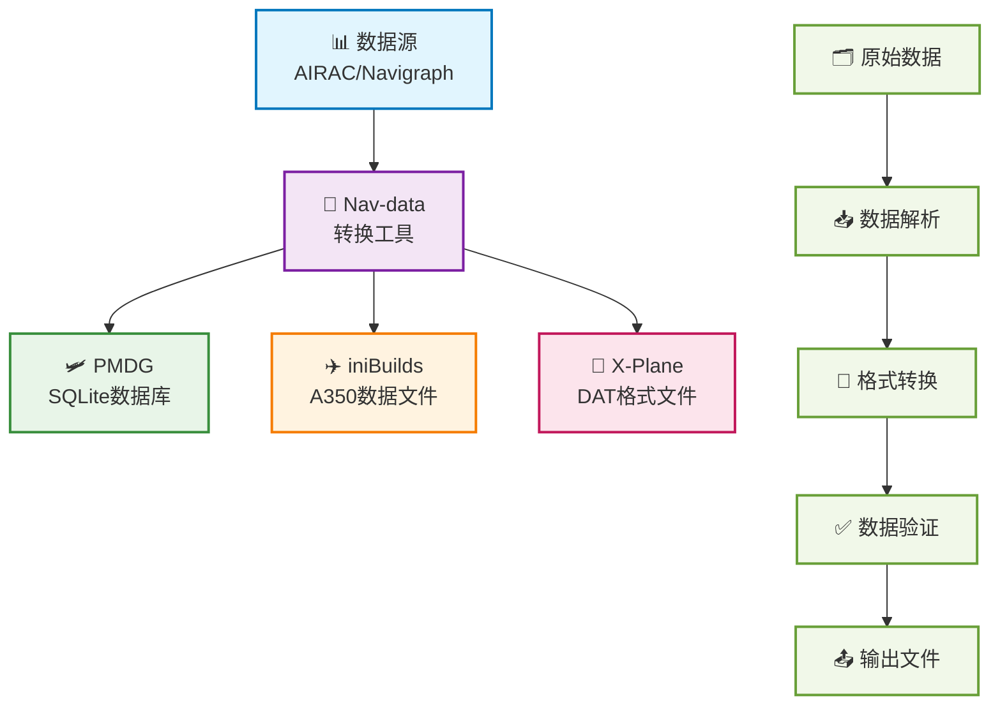

# 欢迎来到 Nav-data 文档 🚀

Nav-data 是一个由航空爱好者共同维护的数据转换项目，致力于为飞行模拟器（如 Microsoft Flight Simulator）提供高质量的导航数据支持。无论你是开发者、飞行员还是爱好者，这里都能找到你需要的资料和指南。

## 🔄 数据转换流程

---

## ✨ 项目特色

  

    
📦

    <h3>多平台支持</h3>
    
支持 PMDG、iniBuilds、X-Plane 等主流飞行模拟器平台

  

  
  

    
🛫

    <h3>详细指南</h3>
    
提供完整的配置、安装与使用指南，新手也能轻松上手

  

  
  

    
🗂️

    <h3>结构清晰</h3>
    
数据结构清晰，易于扩展与维护，支持自定义配置

  

  
  

    
🤝

    <h3>开源协作</h3>
    
欢迎社区贡献与协作，共同构建更好的导航数据工具

  

---

## 🚀 快速开始
1. 选择你的插件： [PMDG 指南](/PMDG/guide/index) | [iniBuilds 指南](/iniBuilds/guide/index)
2. 按照指南进行配置与安装
3. 享受更真实的飞行体验！

---

## 🧭 快速导航

### 📊 平台支持对比

  <table>
    <thead>
      <tr>
        <th>特性</th>
        <th>🛩️ PMDG</th>
        <th>✈️ iniBuilds</th>
        <th>🛫 X-Plane</th>
      </tr>
    </thead>
    <tbody>
      <tr>
        <td><strong>支持飞机</strong></td>
        <td>737系列, 777系列</td>
        <td>A350</td>
        <td>所有X-Plane飞机</td>
      </tr>
      <tr>
        <td><strong>数据格式</strong></td>
        <td>SQLite数据库</td>
        <td>专用数据文件</td>
        <td>DAT格式文件</td>
      </tr>
      <tr>
        <td><strong>安装难度</strong></td>
        <td><StatusBadge type="warning" text="中等" icon="⚠️" /></td>
        <td><StatusBadge type="success" text="简单" icon="✅" /></td>
        <td><StatusBadge type="error" text="复杂" icon="🔴" /></td>
      </tr>
      <tr>
        <td><strong>数据覆盖</strong></td>
        <td><StatusBadge type="success" text="完整" icon="✅" /></td>
        <td><StatusBadge type="success" text="完整" icon="✅" /></td>
        <td><StatusBadge type="warning" text="部分" icon="⚠️" /></td>
      </tr>
      <tr>
        <td><strong>更新频率</strong></td>
        <td>AIRAC周期</td>
        <td>AIRAC周期</td>
        <td>按需更新</td>
      </tr>
    </tbody>
  </table>

### 📚 使用指南

  <a href="/PMDG/guide/index" class="guide-link pmdg">
    
🛩️

    

      <h3>PMDG 指南</h3>
      
PMDG 飞机导航数据转换完整教程

    

  </a>
  
  <a href="/iniBuilds/guide/index" class="guide-link inibuilds">
    
✈️

    

      <h3>iniBuilds 指南</h3>
      
iniBuilds A350 导航数据转换指南

    

  </a>
  
  <a href="/X-Plane/guide/index" class="guide-link xplane">
    
🛫

    

      <h3>X-Plane 指南</h3>
      
X-Plane 导航数据处理完整流程

    

  </a>

### 🆘 获取帮助

  

    <h4>🛩️ PMDG 支持</h4>
    <ul>
      <li><a href="/PMDG/faq">常见问题解答</a></li>
      <li><a href="/PMDG/troubleshooting">故障排除指南</a></li>
    </ul>
  

  
  

    <h4>✈️ iniBuilds 支持</h4>
    <ul>
      <li><a href="/iniBuilds/faq">常见问题解答</a></li>
      <li><a href="/iniBuilds/troubleshooting">故障排除指南</a></li>
    </ul>
  

  
  

    <h4>🛫 X-Plane 支持</h4>
    <ul>
      <li><a href="/X-Plane/faq">常见问题解答</a></li>
      <li><a href="/X-Plane/troubleshooting">故障排除指南</a></li>
    </ul>
  

### 🔧 技术文档

  <a href="/iniBuilds/architecture" class="tech-link">
    🏗️
    项目架构说明
  </a>
  <a href="/iniBuilds/contributing" class="tech-link">
    🤝
    贡献指南
  </a>
  <a href="/iniBuilds/changelog" class="tech-link">
    📋
    更新日志
  </a>

---

## 🌍 加入我们 & 反馈建议
- GitHub: [nav-data](https://github.com/nav-data)
- 有建议或问题？欢迎通过 [Issue](https://github.com/nav-data/nav-data/issues) 或邮件联系我们！

