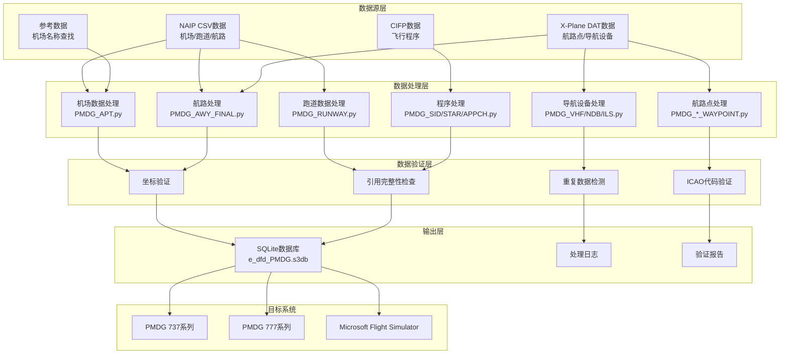
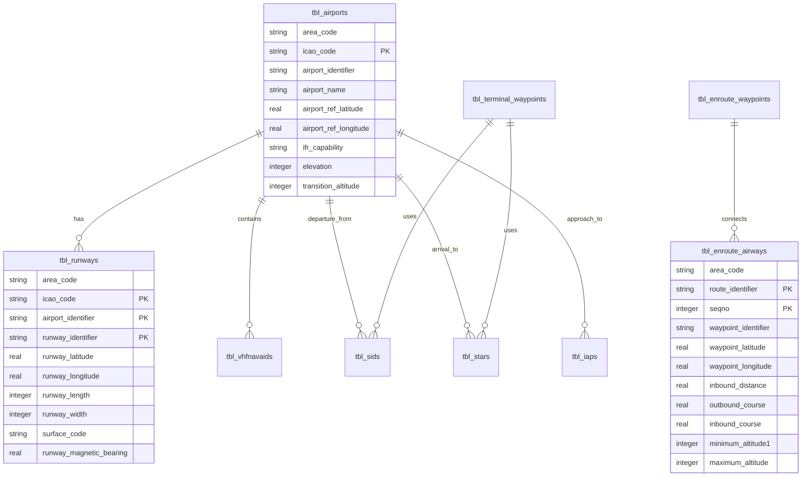
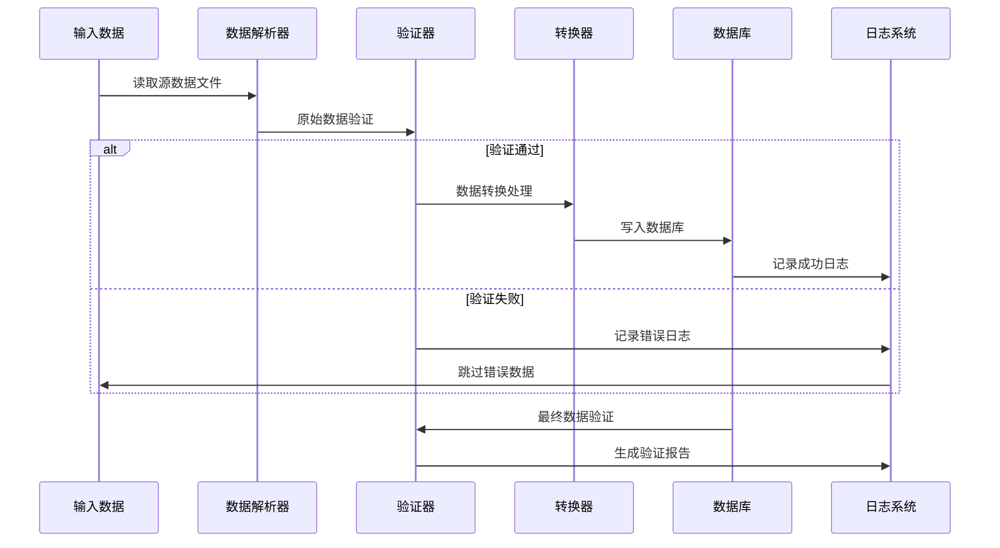

# 🏗️ 技术架构

本文档深入介绍 Nav-data 的系统架构、设计原理和技术实现细节，为开发者和技术用户提供全面的技术参考。

## 📐 系统架构概览

### 整体架构图



### 核心组件说明

| 组件 | 功能 | 技术栈 | 关键特性 |
|------|------|--------|----------|
| **数据解析器** | 多格式数据读取 | pandas, chardet | 自动编码检测、容错处理 |
| **坐标转换器** | 地理坐标处理 | 自定义算法 | DMS↔Decimal转换、精度控制 |
| **磁差计算器** | 磁偏角计算 | pygeomag | WMM2025模型、高精度计算 |
| **数据库引擎** | SQLite数据库 | sqlite3 | PMDG兼容模式、事务处理 |
| **验证引擎** | 数据质量保证 | 自定义验证器 | 多层验证、详细报告 |
| **并发处理器** | 性能优化 | ThreadPoolExecutor | 多线程处理、进度监控 |

## 🧩 模块架构设计

### 1. 数据处理模块

#### 机场数据处理 (`PMDG_APT.py`)

```python
class AirportProcessor:
    """机场数据处理器"""
    
    def __init__(self):
        self.csv_parser = CSVParser(encoding='latin1')
        self.coordinate_converter = CoordinateConverter()
        self.database_writer = DatabaseWriter()
    
    def process(self) -> ProcessResult:
        """主处理流程"""
        # 1. 读取NAIP机场数据
        airports_data = self.csv_parser.read_csv(self.csv_file_path)
        
        # 2. 读取机场名称查找表
        name_lookup = self.load_airport_names()
        
        # 3. 数据处理和转换
        processed_data = []
        for airport in airports_data:
            # 坐标转换: DMS -> Decimal
            lat, lon = self.coordinate_converter.dms_to_decimal(
                airport['GEO_LAT_ACCURACY'],
                airport['GEO_LONG_ACCURACY']
            )
            
            # 数据验证和清理
            if self.validate_airport_data(airport, lat, lon):
                processed_data.append({
                    'icao_code': airport['CODE_ID'][:2],
                    'airport_identifier': airport['CODE_ID'],
                    'airport_name': name_lookup.get(airport['CODE_ID'], 'UNKNOWN'),
                    'latitude': lat,
                    'longitude': lon,
                    # ... 其他字段
                })
        
        # 4. 写入数据库
        return self.database_writer.write_airports(processed_data)
```

#### 航路数据处理 (`PMDG_AWY_FINAL.py`)

这是最复杂的模块，包含智能航路合并算法：

```python
class AirwayProcessor:
    """航路数据处理器 - 支持智能合并"""
    
    def process_airways(self):
        """航路处理主流程"""
        # 1. 读取CSV航路段数据
        route_segments = self.read_route_segments()
        
        # 2. 匹配航路点坐标
        for segment in route_segments:
            icao_code, lat, lon = self.match_waypoint_coordinates(
                segment['waypoint_identifier'],
                segment['code_type']
            )
            segment.update({'lat': lat, 'lon': lon, 'icao': icao_code})
        
        # 3. 智能航路合并
        for route_id in self.get_unique_routes():
            existing_route = self.get_existing_route(route_id)
            new_segments = self.get_route_segments(route_id)
            
            merged_route = self.intelligent_merge(existing_route, new_segments)
            
            # 4. 重新计算航段距离和航向
            self.recalculate_route_geometry(merged_route)
            
            # 5. 更新数据库
            self.update_route_in_database(route_id, merged_route)
    
    def intelligent_merge(self, existing, new_segments):
        """智能航路合并算法"""
        if not existing:
            return new_segments
        
        # 寻找公共航路点
        common_points = self.find_common_waypoints(existing, new_segments)
        
        if not common_points:
            # 无公共点 - 直接追加
            return self.append_segments(existing, new_segments)
        else:
            # 有公共点 - 智能插入
            return self.insert_missing_segments(existing, new_segments, common_points)
```

### 2. 数据验证架构

#### 多层验证体系

```python
class ValidationEngine:
    """数据验证引擎"""
    
    def __init__(self):
        self.validators = [
            CoordinateValidator(),
            ICAOCodeValidator(),
            ReferenceIntegrityValidator(),
            DuplicateDetector(),
            BusinessRuleValidator()
        ]
    
    def validate(self, data: dict) -> ValidationResult:
        """执行多层验证"""
        result = ValidationResult()
        
        for validator in self.validators:
            validator_result = validator.validate(data)
            result.merge(validator_result)
            
            # 严重错误时停止验证
            if validator_result.has_critical_errors():
                break
        
        return result

class CoordinateValidator:
    """坐标验证器"""
    
    # 中国地区坐标边界
    CHINA_BOUNDS = {
        'lat_min': 15.0, 'lat_max': 55.0,
        'lon_min': 70.0, 'lon_max': 140.0
    }
    
    def validate(self, data: dict) -> ValidationResult:
        lat, lon = data.get('latitude'), data.get('longitude')
        
        if not self.is_valid_coordinate(lat, lon):
            return ValidationResult.error(f"坐标超出中国地区范围: {lat}, {lon}")
        
        return ValidationResult.success()
```

### 3. 并发处理架构

#### 多线程处理设计

```python
class ConcurrentProcessor:
    """并发处理器"""
    
    def __init__(self, max_workers=50):
        self.max_workers = min(max_workers, multiprocessing.cpu_count() * 2)
        self.progress_tracker = ProgressTracker()
    
    def process_in_parallel(self, tasks: List[Task]) -> List[Result]:
        """并行处理任务"""
        results = []
        
        with ThreadPoolExecutor(max_workers=self.max_workers) as executor:
            # 提交所有任务
            future_to_task = {
                executor.submit(self.process_task, task): task 
                for task in tasks
            }
            
            # 收集结果并更新进度
            for future in as_completed(future_to_task):
                task = future_to_task[future]
                try:
                    result = future.result()
                    results.append(result)
                    self.progress_tracker.update()
                except Exception as e:
                    logging.error(f"任务 {task.id} 失败: {e}")
        
        return results
```

## 🗄️ 数据库设计

### ER 图



### 表结构详解

#### 核心表设计原则

1. **PMDG兼容性**: 严格遵循PMDG数据库表结构和字段命名
2. **ICAO标准**: 支持国际民航组织数据标准
3. **性能优化**: 合理的索引设计和数据类型选择
4. **数据完整性**: 外键约束和业务规则验证

#### 关键表结构

```sql
-- 机场表
CREATE TABLE tbl_airports (
    area_code TEXT DEFAULT 'EEU',
    icao_code TEXT NOT NULL,
    airport_identifier TEXT PRIMARY KEY,
    airport_name TEXT,
    airport_ref_latitude REAL,
    airport_ref_longitude REAL,
    ifr_capability TEXT DEFAULT 'Y',
    longest_runway_surface_code TEXT,
    elevation INTEGER,
    transition_altitude INTEGER DEFAULT 18000,
    transition_level INTEGER,
    speed_limit INTEGER,
    speed_limit_altitude INTEGER,
    iata_ata_designator TEXT,
    id TEXT UNIQUE
);

-- 航路表
CREATE TABLE tbl_enroute_airways (
    area_code TEXT DEFAULT 'EEU',
    crusing_table_identifier TEXT DEFAULT 'EE',
    route_identifier TEXT NOT NULL,
    seqno INTEGER NOT NULL,
    icao_code TEXT,
    waypoint_identifier TEXT,
    waypoint_latitude REAL,
    waypoint_longitude REAL,
    waypoint_description_code TEXT,
    route_type TEXT DEFAULT 'O',
    inbound_course REAL DEFAULT 0.0,
    inbound_distance REAL DEFAULT 0.0,
    outbound_course REAL DEFAULT 0.0,
    minimum_altitude1 INTEGER DEFAULT 5000,
    minimum_altitude2 INTEGER,
    maximum_altitude INTEGER DEFAULT 99999,
    direction_restriction TEXT,
    flightlevel TEXT DEFAULT 'B',
    id TEXT,
    PRIMARY KEY (route_identifier, seqno)
);
```

## 🔄 数据处理流程

### 处理流水线



### 错误处理策略

```python
class ErrorHandler:
    """错误处理策略"""
    
    ERROR_STRATEGIES = {
        'missing_data': 'log_and_skip',
        'invalid_coordinates': 'log_and_skip', 
        'duplicate_records': 'log_and_merge',
        'reference_not_found': 'log_and_continue',
        'critical_error': 'stop_processing'
    }
    
    def handle_error(self, error_type: str, error_data: dict):
        strategy = self.ERROR_STRATEGIES.get(error_type, 'log_and_continue')
        
        if strategy == 'log_and_skip':
            self.log_error(error_data)
            return ProcessingAction.SKIP
        elif strategy == 'stop_processing':
            self.log_critical_error(error_data)
            raise ProcessingException(error_data)
        # ... 其他策略
```

## 🎯 性能优化设计

### 内存管理

```python
class MemoryManager:
    """内存管理器"""
    
    def __init__(self, max_memory_mb=2048):
        self.max_memory = max_memory_mb * 1024 * 1024
        self.current_usage = 0
    
    def process_in_batches(self, data_source, batch_size=1000):
        """分批处理大数据集"""
        batch = []
        
        for item in data_source:
            batch.append(item)
            self.current_usage += sys.getsizeof(item)
            
            if len(batch) >= batch_size or self.memory_threshold_reached():
                yield batch
                batch = []
                self.gc_collect()  # 强制垃圾回收
    
    def memory_threshold_reached(self) -> bool:
        return self.current_usage > self.max_memory * 0.8
```

### 数据库优化

```python
class DatabaseOptimizer:
    """数据库性能优化"""
    
    PRAGMA_SETTINGS = {
        'journal_mode': 'DELETE',     # PMDG兼容模式
        'synchronous': 'FULL',        # 数据安全优先
        'cache_size': 10000,          # 大缓存提升性能
        'temp_store': 'MEMORY',       # 临时数据存内存
        'mmap_size': 268435456        # 256MB内存映射
    }
    
    def optimize_database(self, connection):
        """应用性能优化设置"""
        for pragma, value in self.PRAGMA_SETTINGS.items():
            connection.execute(f"PRAGMA {pragma} = {value}")
        
        # 创建关键索引
        self.create_performance_indexes(connection)
    
    def create_performance_indexes(self, connection):
        """创建性能优化索引"""
        indexes = [
            "CREATE INDEX IF NOT EXISTS idx_airports_icao ON tbl_airports(icao_code)",
            "CREATE INDEX IF NOT EXISTS idx_airways_route ON tbl_enroute_airways(route_identifier)",
            "CREATE INDEX IF NOT EXISTS idx_waypoints_id ON tbl_enroute_waypoints(waypoint_identifier)",
        ]
        
        for index_sql in indexes:
            connection.execute(index_sql)
```

## 🔍 质量保证体系

### 数据验证框架

```python
class QualityAssurance:
    """质量保证框架"""
    
    def __init__(self):
        self.validation_rules = self.load_validation_rules()
        self.test_cases = self.load_test_cases()
    
    def comprehensive_validation(self, database_path: str) -> QAReport:
        """全面质量检查"""
        report = QAReport()
        
        # 1. 结构验证
        report.add_section(self.validate_schema(database_path))
        
        # 2. 数据完整性验证
        report.add_section(self.validate_integrity(database_path))
        
        # 3. 业务规则验证
        report.add_section(self.validate_business_rules(database_path))
        
        # 4. 性能基准测试
        report.add_section(self.performance_benchmark(database_path))
        
        # 5. PMDG兼容性测试
        report.add_section(self.pmdg_compatibility_test(database_path))
        
        return report
    
    def validate_business_rules(self, database_path: str) -> ValidationSection:
        """业务规则验证"""
        rules = [
            "航路必须连接有效的航路点",
            "机场必须有至少一条跑道",
            "ILS频率必须在有效范围内",
            "航路高度限制必须合理",
            "坐标必须在中国地区范围内"
        ]
        
        results = []
        for rule in rules:
            result = self.check_business_rule(database_path, rule)
            results.append(result)
        
        return ValidationSection("业务规则验证", results)
```

## 🔧 扩展性设计

### 插件架构

```python
class PluginManager:
    """插件管理器"""
    
    def __init__(self):
        self.processors = {}
        self.validators = {}
        self.exporters = {}
    
    def register_processor(self, name: str, processor_class):
        """注册数据处理器插件"""
        self.processors[name] = processor_class
    
    def register_validator(self, name: str, validator_class):
        """注册验证器插件"""
        self.validators[name] = validator_class
    
    def load_plugins(self, plugin_directory: str):
        """动态加载插件"""
        for plugin_file in glob.glob(f"{plugin_directory}/*.py"):
            plugin_module = importlib.import_module(plugin_file)
            if hasattr(plugin_module, 'register'):
                plugin_module.register(self)

# 示例插件
class CustomAirportProcessor(BaseProcessor):
    """自定义机场处理器插件"""
    
    def process(self, data):
        # 自定义处理逻辑
        return super().process(data)

def register(plugin_manager):
    """插件注册函数"""
    plugin_manager.register_processor('custom_airport', CustomAirportProcessor)
```

### 配置管理

```python
class ConfigurationManager:
    """配置管理器"""
    
    def __init__(self, config_path: str = "config/settings.yaml"):
        self.config = self.load_config(config_path)
        self.validators = self.load_config_validators()
    
    def load_config(self, path: str) -> dict:
        """加载配置文件"""
        with open(path, 'r', encoding='utf-8') as f:
            return yaml.safe_load(f)
    
    def validate_config(self) -> bool:
        """验证配置的有效性"""
        for validator in self.validators:
            if not validator.validate(self.config):
                return False
        return True
    
    def get_nested_value(self, key_path: str, default=None):
        """获取嵌套配置值"""
        keys = key_path.split('.')
        value = self.config
        
        for key in keys:
            if isinstance(value, dict) and key in value:
                value = value[key]
            else:
                return default
        
        return value

# 配置文件示例 (settings.yaml)
"""
data_sources:
  naip:
    directory: "data/input/naip"
    encoding: "latin1"
  xplane:
    directory: "data/input/xplane"
    encoding: "utf-8"

processing:
  batch_size: 1000
  max_workers: 50
  memory_limit_mb: 2048

database:
  path: "data/output/e_dfd_PMDG.s3db"
  pragmas:
    journal_mode: "DELETE"
    synchronous: "FULL"

validation:
  coordinate_bounds:
    china:
      lat_min: 15.0
      lat_max: 55.0
      lon_min: 70.0
      lon_max: 140.0
"""
```

## 📊 监控和日志

### 结构化日志系统

```python
class StructuredLogger:
    """结构化日志系统"""
    
    def __init__(self, name: str):
        self.logger = logging.getLogger(name)
        self.setup_handlers()
    
    def setup_handlers(self):
        """设置日志处理器"""
        # 控制台处理器
        console_handler = logging.StreamHandler()
        console_handler.setFormatter(ColoredFormatter())
        
        # 文件处理器
        file_handler = RotatingFileHandler(
            f"logs/{self.logger.name}.log",
            maxBytes=10*1024*1024,
            backupCount=5
        )
        file_handler.setFormatter(JSONFormatter())
        
        self.logger.addHandler(console_handler)
        self.logger.addHandler(file_handler)
    
    def log_processing_start(self, module: str, input_size: int):
        """记录处理开始"""
        self.logger.info("Processing started", extra={
            'module': module,
            'input_size': input_size,
            'timestamp': datetime.utcnow().isoformat(),
            'event_type': 'processing_start'
        })
    
    def log_processing_complete(self, module: str, output_size: int, duration: float):
        """记录处理完成"""
        self.logger.info("Processing completed", extra={
            'module': module,
            'output_size': output_size,
            'duration_seconds': duration,
            'records_per_second': output_size / duration if duration > 0 else 0,
            'timestamp': datetime.utcnow().isoformat(),
            'event_type': 'processing_complete'
        })
```

## 🔒 安全性设计

### 数据安全

```python
class SecurityManager:
    """安全管理器"""
    
    def __init__(self):
        self.input_sanitizer = InputSanitizer()
        self.path_validator = PathValidator()
    
    def validate_input_path(self, path: str) -> bool:
        """验证输入路径安全性"""
        # 防止路径遍历攻击
        normalized_path = os.path.normpath(path)
        if '..' in normalized_path:
            raise SecurityException("路径包含非法字符")
        
        # 确保路径在允许的目录内
        allowed_dirs = ['data/input', 'config']
        if not any(normalized_path.startswith(allowed) for allowed in allowed_dirs):
            raise SecurityException("路径不在允许的目录内")
        
        return True
    
    def sanitize_sql_input(self, value: str) -> str:
        """SQL输入清理"""
        if not isinstance(value, str):
            return value
        
        # 移除潜在的SQL注入字符
        dangerous_chars = ["'", '"', ';', '--', '/*', '*/']
        for char in dangerous_chars:
            value = value.replace(char, '')
        
        return value
```

---

这个技术架构文档为 Nav-data 项目提供了全面的技术视图，涵盖了系统设计、数据流、性能优化、质量保证和安全性等各个方面。开发者可以基于这个架构进行二次开发和功能扩展。 