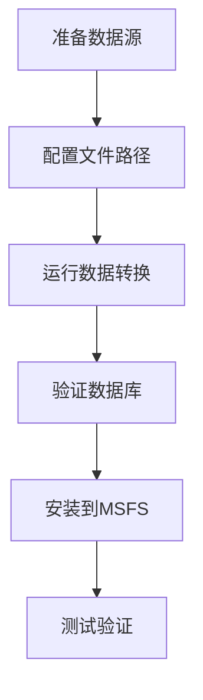

# 🚀 使用说明

本指南详细介绍如何使用 Nav-data 工具将航空导航数据转换为 PMDG 兼容的数据库格式，并安装到 Microsoft Flight Simulator 中。

## 📋 转换流程概览

Nav-data 的数据转换遵循以下主要步骤：



### 转换模块说明

| 模块名 | 功能 | 输入数据 | 输出表 |
|--------|------|----------|--------|
| `PMDG_APT.py` | 机场数据处理 | AD_HP.csv + Airport.dat | tbl_airports |
| `PMDG_RUNWAY.py` | 跑道信息处理 | RWY*.csv + earth_nav.dat | tbl_runways |
| `PMDG_VHF.py` | VOR/DME数据处理 | earth_nav.dat | tbl_vhfnavaids |
| `PMDG_ENRT_NDB.py` | NDB数据处理 | earth_nav.dat | tbl_enroute_ndbnavaids |
| `PMDG_ENRT_WAYPOINT.py` | 航路点处理 | earth_fix.dat | tbl_enroute_waypoints |
| `PMDG_TMA_WAYPOINT.py` | 终端区航路点 | earth_fix.dat | tbl_terminal_waypoints |
| `PMDG_AWY_FINAL.py` | 航路数据处理 | RTE_SEG.csv + earth_*.dat | tbl_enroute_airways |
| `PMDG_ILS.py` | ILS/GS数据处理 | earth_nav.dat | tbl_localizers_glideslopes |
| `PMDG_SID.py` | 标准离场程序 | CIFP .dat文件 | tbl_sids |
| `PMDG_STAR.py` | 标准到达程序 | CIFP .dat文件 | tbl_stars |
| `PMDG_APPCH.py` | 进近程序 | CIFP .dat文件 | tbl_iaps |

## 🔄 数据转换步骤

### 第一步: 数据准备

1. **获取 NAIP 数据**
   ```bash
   # 将 NAIP CSV 文件放置到指定目录
   cp /source/path/*.csv data/input/naip/
   
   # 验证文件完整性
   ls data/input/naip/
   # 应显示: AD_HP.csv, RWY_DIRECTION.csv, RWY.csv, RTE_SEG.csv
   ```

2. **获取 X-Plane 数据**
   ```bash
   # 从 X-Plane 安装目录复制数据文件
   cp "/path/to/X-Plane/Custom Data/earth_fix.dat" data/input/xplane/
   cp "/path/to/X-Plane/Custom Data/earth_nav.dat" data/input/xplane/
   ```

3. **获取 CIFP 数据**
   ```bash
   # 复制 CIFP 程序数据文件
   cp -r /path/to/CIFP/* data/input/cifp/
   ```

4. **准备机场查找文件**
   ```bash
   # 复制机场名称查找文件
   cp /path/to/Airport.dat data/input/
   ```

### 第二步: 激活环境并验证

```bash
# 激活虚拟环境
source nav-data-env/bin/activate  # macOS/Linux
# 或 nav-data-env\Scripts\activate  # Windows

# 验证配置
python scripts/validate_config.py
```

### 第三步: 执行数据转换

#### 方法 A: 单独运行各模块 (推荐)

按照数据依赖关系，逐步运行各个模块：

```bash
# 1. 处理机场基础数据
echo "🏢 处理机场数据..."
python PMDG_APT.py

# 2. 处理跑道数据
echo "🛫 处理跑道数据..."
python PMDG_RUNWAY.py

# 3. 处理导航设备
echo "📡 处理VHF导航设备..."
python PMDG_VHF.py

echo "📡 处理NDB导航设备..."
python PMDG_ENRT_NDB.py

echo "📍 处理ILS系统..."
python PMDG_ILS.py

# 4. 处理航路点
echo "🗺️ 处理航路点数据..."
python PMDG_ENRT_WAYPOINT.py
python PMDG_TMA_WAYPOINT.py

# 5. 处理航路数据
echo "🛣️ 处理航路数据..."
python PMDG_AWY_FINAL.py

# 6. 处理飞行程序 (如有CIFP数据)
echo "📋 处理标准离场程序..."
python PMDG_SID.py

echo "📋 处理标准到达程序..."
python PMDG_STAR.py

echo "📋 处理进近程序..."
python PMDG_APPCH.py
```

#### 方法 B: 批量处理脚本

创建自动化处理脚本：

```bash
# scripts/run_conversion.sh
#!/bin/bash

set -e  # 遇到错误时停止

echo "🚀 开始 Nav-data 转换流程..."

# 检查虚拟环境
if [[ "$VIRTUAL_ENV" == "" ]]; then
    echo "❌ 请先激活虚拟环境"
    exit 1
fi

# 验证配置
echo "🔍 验证配置..."
python scripts/validate_config.py

# 创建输出目录
mkdir -p data/output logs

# 记录开始时间
start_time=$(date +%s)

# 转换函数
run_module() {
    local module=$1
    local description=$2
    
    echo "📊 $description"
    if python $module.py; then
        echo "✅ $module 完成"
    else
        echo "❌ $module 失败"
        exit 1
    fi
    echo "---"
}

# 执行转换步骤
run_module "PMDG_APT" "处理机场数据"
run_module "PMDG_RUNWAY" "处理跑道数据"
run_module "PMDG_VHF" "处理VHF导航设备"
run_module "PMDG_ENRT_NDB" "处理NDB导航设备"
run_module "PMDG_ILS" "处理ILS系统"
run_module "PMDG_ENRT_WAYPOINT" "处理航路点数据"
run_module "PMDG_TMA_WAYPOINT" "处理终端区航路点"
run_module "PMDG_AWY_FINAL" "处理航路数据"

# 程序数据 (可选)
if [[ -d "data/input/cifp" ]] && [[ $(ls -A data/input/cifp) ]]; then
    run_module "PMDG_SID" "处理标准离场程序"
    run_module "PMDG_STAR" "处理标准到达程序"
    run_module "PMDG_APPCH" "处理进近程序"
fi

# 验证生成的数据库
echo "🔍 验证数据库..."
python db_validator.py data/output/e_dfd_PMDG.s3db

# 计算总耗时
end_time=$(date +%s)
duration=$((end_time - start_time))
echo "✅ 转换完成! 总耗时: ${duration}秒"

echo "📊 生成的数据库文件: data/output/e_dfd_PMDG.s3db"
echo "📝 日志文件位置: logs/"
```

### 第四步: 验证生成的数据库

```bash
# 运行数据库验证工具
python db_validator.py data/output/e_dfd_PMDG.s3db

# 检查数据库统计信息
python -c "
import sqlite3
conn = sqlite3.connect('data/output/e_dfd_PMDG.s3db')
cursor = conn.cursor()

# 获取表列表
cursor.execute(\"SELECT name FROM sqlite_master WHERE type='table'\")
tables = cursor.fetchall()

print('📊 数据库表统计:')
for table in tables:
    table_name = table[0]
    cursor.execute(f'SELECT COUNT(*) FROM {table_name}')
    count = cursor.fetchone()[0]
    print(f'  {table_name}: {count:,} 条记录')

conn.close()
"
```

## 📥 安装到 Microsoft Flight Simulator

### 第一步: 定位 PMDG 飞机

1. **找到 MSFS Community 文件夹**
   
   根据您的 MSFS 安装方式：
   
   - **Microsoft Store**: `%LOCALAPPDATA%\Packages\Microsoft.FlightSimulator_8wekyb3d8bbwe\LocalCache\Packages\Community`
   - **Steam**: `%APPDATA%\Microsoft Flight Simulator\Packages\Community`
   - **Xbox Game Pass**: `%LOCALAPPDATA%\Packages\Microsoft.FlightDashboard_8wekyb3d8bbwe\LocalCache\Packages\Community`

2. **确认 PMDG 飞机安装**
   ```cmd
   dir Community
   ```
   应显示类似以下的目录：
   ```
   pmdg-aircraft-737
   pmdg-aircraft-738
   pmdg-aircraft-77w
   ```

### 第二步: 备份原有数据

为每架 PMDG 飞机备份原有导航数据：

```cmd
REM 示例：备份 PMDG 737-800
cd "Community\pmdg-aircraft-738\Config"
ren Navdata Navdata_backup_%DATE:~0,10%

REM 备份 PMDG 777-300ER  
cd "..\..\..\pmdg-aircraft-77w\Config"
ren Navdata Navdata_backup_%DATE:~0,10%
```

### 第三步: 安装新数据库

```cmd
REM 为每架飞机创建 Navdata 目录并复制数据库
mkdir "Community\pmdg-aircraft-738\Config\Navdata"
copy "Nav-data\data\output\e_dfd_PMDG.s3db" "Community\pmdg-aircraft-738\Config\Navdata\"

mkdir "Community\pmdg-aircraft-77w\Config\Navdata"
copy "Nav-data\data\output\e_dfd_PMDG.s3db" "Community\pmdg-aircraft-77w\Config\Navdata\"
```

### 第四步: 清除 MSFS 缓存

删除 MSFS 导航数据缓存，强制重新加载：

```cmd
REM Microsoft Store 版本
rmdir /s /q "%LOCALAPPDATA%\Packages\Microsoft.FlightSimulator_8wekyb3d8bbwe\LocalState\packages\pmdg-aircraft-738\work\NavigationData"
rmdir /s /q "%LOCALAPPDATA%\Packages\Microsoft.FlightSimulator_8wekyb3d8bbwe\LocalState\packages\pmdg-aircraft-77w\work\NavigationData"

REM Steam 版本  
rmdir /s /q "%APPDATA%\Microsoft Flight Simulator\LocalState\packages\pmdg-aircraft-738\work\NavigationData"
rmdir /s /q "%APPDATA%\Microsoft Flight Simulator\LocalState\packages\pmdg-aircraft-77w\work\NavigationData"
```

## ✅ 验证安装

### 第一步: 启动 MSFS

1. 完全关闭 Microsoft Flight Simulator
2. 重新启动 MSFS
3. 等待完全加载

### 第二步: 检查 PMDG 飞机

1. **选择 PMDG 飞机**
   - 选择任一 PMDG 737 或 777 飞机
   - 选择中国地区的机场（如 ZBAA 北京首都）

2. **检查 FMC 数据**
   - 进入驾驶舱
   - 打开 CDU/FMC
   - 检查导航数据库日期
   - 验证航路点可用性

### 第三步: 功能测试

#### 测试航路点

```
CDU操作步骤:
1. MENU → NAV DATA → WAYPOINT
2. 输入测试航路点: ABING
3. 确认显示正确的坐标信息
```

#### 测试机场数据

```
CDU操作步骤:
1. MENU → NAV DATA → AIRPORT
2. 输入测试机场: ZBAA
3. 验证跑道信息和频率数据
```

#### 测试飞行程序

```
CDU操作步骤:
1. ROUTE → DEPARTURE
2. 选择北京首都机场 (ZBAA)
3. 验证 SID 程序可用性
4. ROUTE → ARRIVAL
5. 验证 STAR 和进近程序
```

## 🔧 高级用法

### 1. 增量更新

如果只需要更新特定类型的数据：

```bash
# 只更新航路数据
python PMDG_AWY_FINAL.py

# 只更新机场数据
python PMDG_APT.py
python PMDG_RUNWAY.py
```

### 2. 批量安装脚本

创建自动安装脚本：

```python
# scripts/install_to_msfs.py
import os
import shutil
import winreg
import glob
from pathlib import Path

def find_msfs_community():
    """自动查找 MSFS Community 文件夹"""
    possible_paths = [
        os.path.expandvars(r"%LOCALAPPDATA%\Packages\Microsoft.FlightSimulator_8wekyb3d8bbwe\LocalCache\Packages\Community"),
        os.path.expandvars(r"%APPDATA%\Microsoft Flight Simulator\Packages\Community"),
        os.path.expandvars(r"%LOCALAPPDATA%\Packages\Microsoft.FlightDashboard_8wekyb3d8bbwe\LocalCache\Packages\Community")
    ]
    
    for path in possible_paths:
        if os.path.exists(path):
            return path
    return None

def install_navdata():
    """安装导航数据到所有 PMDG 飞机"""
    
    community_path = find_msfs_community()
    if not community_path:
        print("❌ 无法找到 MSFS Community 文件夹")
        return False
    
    print(f"📂 找到 Community 文件夹: {community_path}")
    
    # 查找 PMDG 飞机
    pmdg_aircraft = glob.glob(os.path.join(community_path, "pmdg-aircraft-*"))
    
    if not pmdg_aircraft:
        print("❌ 未找到 PMDG 飞机")
        return False
    
    database_path = "data/output/e_dfd_PMDG.s3db"
    if not os.path.exists(database_path):
        print(f"❌ 数据库文件不存在: {database_path}")
        return False
    
    for aircraft_path in pmdg_aircraft:
        aircraft_name = os.path.basename(aircraft_path)
        config_path = os.path.join(aircraft_path, "Config")
        navdata_path = os.path.join(config_path, "Navdata")
        
        print(f"🛫 处理 {aircraft_name}...")
        
        # 备份原有数据
        if os.path.exists(navdata_path):
            backup_path = f"{navdata_path}_backup"
            if os.path.exists(backup_path):
                shutil.rmtree(backup_path)
            shutil.move(navdata_path, backup_path)
            print(f"  💾 已备份原有数据到 {backup_path}")
        
        # 创建新的 Navdata 目录
        os.makedirs(navdata_path, exist_ok=True)
        
        # 复制数据库文件
        dest_db = os.path.join(navdata_path, "e_dfd_PMDG.s3db")
        shutil.copy2(database_path, dest_db)
        print(f"  ✅ 已安装数据库到 {dest_db}")
    
    print("✅ 所有 PMDG 飞机的导航数据安装完成!")
    print("⚠️  请重启 Microsoft Flight Simulator 以加载新数据")
    return True

if __name__ == "__main__":
    install_navdata()
```

### 3. 数据对比工具

创建工具对比不同版本的数据：

```python
# scripts/compare_databases.py
import sqlite3
import sys

def compare_databases(db1_path, db2_path):
    """对比两个数据库的差异"""
    
    conn1 = sqlite3.connect(db1_path)
    conn2 = sqlite3.connect(db2_path)
    
    cursor1 = conn1.cursor()
    cursor2 = conn2.cursor()
    
    # 获取表列表
    cursor1.execute("SELECT name FROM sqlite_master WHERE type='table'")
    tables1 = {row[0] for row in cursor1.fetchall()}
    
    cursor2.execute("SELECT name FROM sqlite_master WHERE type='table'")
    tables2 = {row[0] for row in cursor2.fetchall()}
    
    print("📊 数据库对比报告")
    print("=" * 50)
    
    # 对比表结构
    common_tables = tables1.intersection(tables2)
    only_in_db1 = tables1 - tables2
    only_in_db2 = tables2 - tables1
    
    if only_in_db1:
        print(f"仅在 {db1_path} 中的表: {only_in_db1}")
    if only_in_db2:
        print(f"仅在 {db2_path} 中的表: {only_in_db2}")
    
    # 对比记录数量
    for table in common_tables:
        cursor1.execute(f"SELECT COUNT(*) FROM {table}")
        count1 = cursor1.fetchone()[0]
        
        cursor2.execute(f"SELECT COUNT(*) FROM {table}")
        count2 = cursor2.fetchone()[0]
        
        diff = count2 - count1
        status = "📈" if diff > 0 else "📉" if diff < 0 else "➡️"
        print(f"{status} {table}: {count1} → {count2} ({diff:+d})")
    
    conn1.close()
    conn2.close()

if __name__ == "__main__":
    if len(sys.argv) != 3:
        print("用法: python compare_databases.py <数据库1> <数据库2>")
        sys.exit(1)
    
    compare_databases(sys.argv[1], sys.argv[2])
```

## 🔍 故障排除

### 常见问题及解决方案

#### 1. 转换过程中断
**症状**: 转换过程中出现错误并停止
**解决**:
```bash
# 检查错误日志
cat logs/PMDG_*.log | grep ERROR

# 重新运行失败的模块
python [失败的模块].py
```

#### 2. MSFS 无法识别数据
**症状**: PMDG FMC 显示 "DB OUT OF DATE"
**解决**:
```bash
# 确认数据库文件位置正确
ls "Community/pmdg-aircraft-*/Config/Navdata/"

# 重新清除缓存
rmdir /s /q "%LOCALAPPDATA%\...\NavigationData"

# 重启 MSFS
```

#### 3. 内存不足错误
**症状**: "MemoryError" 或系统变慢
**解决**:
```bash
# 减少批处理大小
# 编辑 PMDG_TMA_WAYPOINT.py
# 将 batch_size=1000 改为 batch_size=500

# 关闭其他应用程序
# 增加虚拟内存
```

#### 4. 权限问题
**症状**: "Permission denied" 错误
**解决**:
```cmd
REM Windows: 以管理员身份运行
REM 或修改文件夹权限
icacls "Community" /grant %USERNAME%:F /t
```

### 日志分析

检查各模块的日志文件以了解详细信息：

```bash
# 查看处理统计
grep "处理完成" logs/PMDG_*.log

# 查看错误信息
grep "ERROR\|错误" logs/PMDG_*.log

# 查看警告信息
grep "WARNING\|警告" logs/PMDG_*.log
```

---

**完成**: 您现在已经掌握了 Nav-data 的完整使用流程！如需了解更多高级功能，请参考[技术架构](../architecture.md)文档。 