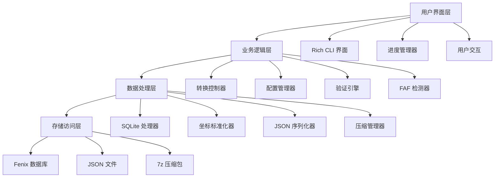
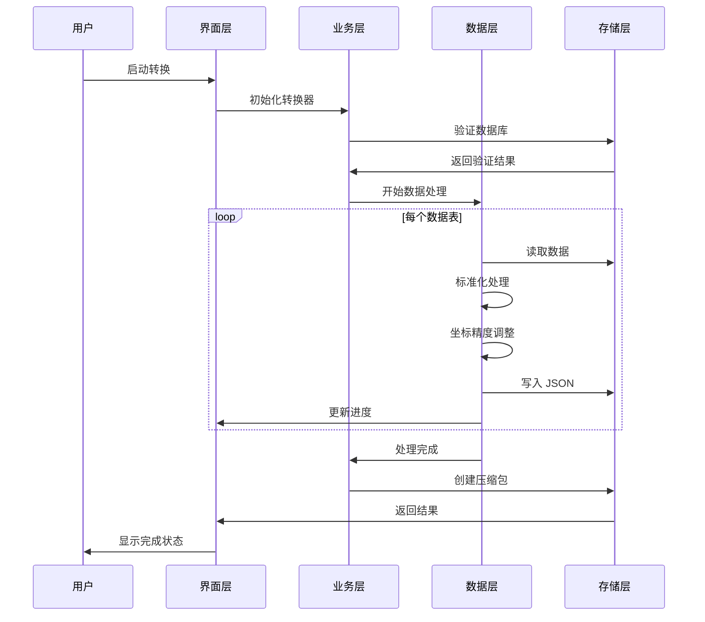

# 🏗️ TFDI 导航数据转换器架构

## 系统概览

TFDI 导航数据转换器是一个专业的航空导航数据转换工具，专门设计用于将 Fenix A320 导航数据库转换为 TFDI MD-11 兼容的 JSON 格式。该工具采用现代化的架构设计，提供高效、可靠的数据转换服务。

## 🎯 设计原则

### 1. 数据完整性优先
- **严格验证**：多层数据验证机制
- **关系保持**：维护导航数据之间的依赖关系
- **精度保证**：保持坐标和计算的高精度
- **一致性检查**：确保转换后数据的逻辑一致性

### 2. 性能优化导向
- **SQLite 优化**：WAL 模式和性能调优
- **批量处理**：内存高效的批处理策略
- **缓存机制**：智能数据缓存和复用
- **压缩优化**：快速 7z 压缩和清理

### 3. 用户体验至上
- **Rich CLI**：现代化彩色终端界面
- **实时反馈**：详细的进度显示和状态更新
- **友好提示**：专业的错误处理和恢复建议
- **交互设计**：直观的操作流程引导

## 🏗️ 系统架构

### 整体架构图



### 核心组件详解

#### 1. 用户界面层 (UI Layer)
**职责**: 提供用户交互界面和反馈
```python
class RichInterface:
    """Rich CLI 界面管理器"""
    - progress_tracking: 进度条管理
    - status_display: 状态信息显示
    - error_presentation: 错误信息展示
    - user_input: 用户输入处理
```

#### 2. 业务逻辑层 (Business Layer)
**职责**: 核心业务逻辑和流程控制
```python
class FenixToTFDIConverter:
    """主转换器类"""
    - database_validation: 数据库验证
    - conversion_orchestration: 转换流程编排
    - faf_detection: FAF 点检测
    - data_normalization: 数据标准化
```

#### 3. 数据处理层 (Data Layer)
**职责**: 数据转换和处理算法
```python
class DataProcessor:
    """数据处理核心"""
    - coordinate_precision: 坐标精度处理
    - column_standardization: 列名标准化
    - relationship_mapping: 关系映射
    - format_conversion: 格式转换
```

#### 4. 存储访问层 (Storage Layer)
**职责**: 数据库访问和文件操作
```python
class StorageManager:
    """存储管理器"""
    - sqlite_optimization: SQLite 性能优化
    - file_operations: 文件读写操作
    - compression_handling: 压缩文件处理
    - backup_management: 备份管理
```

## 📊 数据流架构

### 转换流水线



### 数据映射架构


## 🔧 技术栈

### 核心技术

| 组件 | 技术选型 | 版本要求 | 用途 |
|------|----------|----------|------|
| **Python** | Python 3.8+ | ≥ 3.8.0 | 主要编程语言 |
| **Rich** | Rich Library | ≥ 12.0.0 | CLI 界面美化 |
| **SQLite3** | 内置模块 | Python 内置 | 数据库访问 |
| **Pandas** | DataFrame | ≥ 1.3.0 | 数据处理 |
| **JSON** | 内置模块 | Python 内置 | 数据序列化 |
| **py7zr** | 7-Zip Python | ≥ 0.18.0 | 压缩处理 |

### 架构特征

#### 1. 模块化设计
```python
fenix_to_tfdi/
├── core/                  # 核心模块
│   ├── converter.py       # 主转换器
│   ├── validator.py       # 数据验证器
│   └── config.py         # 配置管理
├── data/                  # 数据处理
│   ├── processor.py       # 数据处理器
│   ├── normalizer.py      # 标准化工具
│   └── serializer.py     # 序列化工具
├── ui/                    # 用户界面
│   ├── cli.py            # 命令行界面
│   └── progress.py       # 进度管理
└── utils/                 # 工具模块
    ├── storage.py        # 存储工具
    └── compression.py    # 压缩工具
```

#### 2. 配置驱动架构
```python
@dataclass
class ConverterConfig:
    """转换器配置类"""
    output_dir: str = "Primary"
    procedure_legs_dir: str = "Primary/ProcedureLegs"
    archive_name: str = "Primary.7z"
    coordinate_precision: int = 8
    vnav_threshold: float = 2.5
    
    # SQLite 优化配置
    sqlite_pragmas: Dict[str, str] = field(default_factory=lambda: {
        "journal_mode": "WAL",
        "synchronous": "NORMAL",
        "cache_size": "10000",
        "temp_store": "MEMORY"
    })
```

## 🚀 性能架构

### 内存管理策略

#### 1. 流式处理
```python
def process_large_table(table_name: str, batch_size: int = 1000):
    """流式处理大表数据"""
    offset = 0
    while True:
        query = f"""
        SELECT * FROM {table_name} 
        LIMIT {batch_size} OFFSET {offset}
        """
        
        batch = execute_query(query)
        if not batch:
            break
            
        process_batch(batch)
        offset += batch_size
```

#### 2. 缓存优化
```python
class WaypointCache:
    """航路点缓存管理"""
    def __init__(self, max_size: int = 10000):
        self._cache: Dict[str, WaypointData] = {}
        self._max_size = max_size
        self._access_times: Dict[str, float] = {}
    
    def get_waypoint(self, waypoint_id: str) -> Optional[WaypointData]:
        """获取缓存的航路点数据"""
        if waypoint_id in self._cache:
            self._access_times[waypoint_id] = time.time()
            return self._cache[waypoint_id]
        return None
```

### 并发处理架构

#### 1. 多线程设计
```python
class ConcurrentProcessor:
    """并发处理器"""
    def __init__(self, max_workers: int = 4):
        self.max_workers = max_workers
        self.executor = ThreadPoolExecutor(max_workers=max_workers)
    
    def process_tables_parallel(self, tables: List[str]):
        """并行处理多个表"""
        futures = []
        for table in tables:
            future = self.executor.submit(self.process_table, table)
            futures.append(future)
        
        # 等待所有任务完成
        concurrent.futures.wait(futures)
```

#### 2. 资源池管理
```python
class DatabaseConnectionPool:
    """数据库连接池"""
    def __init__(self, db_path: str, pool_size: int = 5):
        self.db_path = db_path
        self.pool_size = pool_size
        self.connections: Queue = Queue(maxsize=pool_size)
        self._init_pool()
    
    def get_connection(self) -> sqlite3.Connection:
        """获取数据库连接"""
        return self.connections.get()
    
    def return_connection(self, conn: sqlite3.Connection):
        """归还数据库连接"""
        self.connections.put(conn)
```

## 🔒 安全架构

### 数据保护机制

#### 1. 输入验证
```python
class InputValidator:
    """输入验证器"""
    
    @staticmethod
    def validate_database_path(path: str) -> bool:
        """验证数据库路径安全性"""
        # 检查路径遍历攻击
        if ".." in path or path.startswith("/"):
            return False
        
        # 验证文件扩展名
        if not path.endswith(('.db', '.db3', '.sqlite')):
            return False
        
        return True
    
    @staticmethod  
    def validate_terminal_id(terminal_id: int) -> bool:
        """验证终端ID范围"""
        return 1 <= terminal_id <= 999999
```

#### 2. 错误隔离
```python
class SafeConverter:
    """安全转换器"""
    
    def safe_convert_table(self, table_name: str) -> bool:
        """安全的表转换"""
        try:
            with self.create_transaction() as transaction:
                result = self.convert_table(table_name)
                transaction.commit()
                return result
        except DatabaseError as e:
            self.logger.error(f"数据库错误: {e}")
            transaction.rollback()
            return False
        except Exception as e:
            self.logger.error(f"未知错误: {e}")
            return False
```

## 📈 可扩展架构

### 插件系统设计

#### 1. 转换器插件接口
```python
class ConverterPlugin(ABC):
    """转换器插件抽象基类"""
    
    @abstractmethod
    def get_name(self) -> str:
        """获取插件名称"""
        pass
    
    @abstractmethod
    def get_supported_formats(self) -> List[str]:
        """获取支持的格式"""
        pass
    
    @abstractmethod
    def convert_data(self, data: Any, config: ConverterConfig) -> Any:
        """转换数据"""
        pass
```

#### 2. 格式扩展机制
```python
class FormatRegistry:
    """格式注册表"""
    
    def __init__(self):
        self._converters: Dict[str, ConverterPlugin] = {}
    
    def register_converter(self, format_name: str, converter: ConverterPlugin):
        """注册转换器"""
        self._converters[format_name] = converter
    
    def get_converter(self, format_name: str) -> Optional[ConverterPlugin]:
        """获取转换器"""
        return self._converters.get(format_name)
```

### 数据源扩展

#### 1. 数据源抽象
```python
class DataSource(ABC):
    """数据源抽象基类"""
    
    @abstractmethod
    def connect(self) -> bool:
        """连接数据源"""
        pass
    
    @abstractmethod
    def get_tables(self) -> List[str]:
        """获取表列表"""
        pass
    
    @abstractmethod
    def query_data(self, query: str) -> Iterator[Dict]:
        """查询数据"""
        pass
```

## 🔄 维护性架构

### 日志记录系统

#### 1. 结构化日志
```python
class StructuredLogger:
    """结构化日志记录器"""
    
    def __init__(self, name: str):
        self.logger = logging.getLogger(name)
        self.logger.setLevel(logging.INFO)
        
        # Rich 格式化处理器
        rich_handler = RichHandler(rich_tracebacks=True)
        rich_handler.setFormatter(
            logging.Formatter(
                "%(asctime)s - %(name)s - %(levelname)s - %(message)s"
            )
        )
        self.logger.addHandler(rich_handler)
    
    def log_conversion_start(self, table_name: str, record_count: int):
        """记录转换开始"""
        self.logger.info(
            f"开始转换表 {table_name}",
            extra={
                "table": table_name,
                "record_count": record_count,
                "operation": "conversion_start"
            }
        )
```

#### 2. 性能监控
```python
class PerformanceMonitor:
    """性能监控器"""
    
    def __init__(self):
        self.metrics: Dict[str, List[float]] = defaultdict(list)
    
    @contextmanager
    def measure_time(self, operation: str):
        """测量操作耗时"""
        start_time = time.time()
        try:
            yield
        finally:
            elapsed = time.time() - start_time
            self.metrics[operation].append(elapsed)
            self.logger.debug(f"{operation} 耗时: {elapsed:.2f}s")
```

## 📊 测试架构

### 测试策略

#### 1. 分层测试
```python
# 单元测试
class TestDataProcessor(unittest.TestCase):
    def test_coordinate_normalization(self):
        """测试坐标标准化"""
        processor = DataProcessor()
        result = processor.normalize_coordinate(39.916667, 8)
        self.assertEqual(result, 39.91666700)

# 集成测试  
class TestConverterIntegration(unittest.TestCase):
    def test_full_conversion_pipeline(self):
        """测试完整转换流水线"""
        converter = FenixToTFDIConverter(test_config)
        result = converter.convert(test_database_path)
        self.assertTrue(result)

# 性能测试
class TestPerformance(unittest.TestCase):
    def test_large_database_conversion(self):
        """测试大型数据库转换性能"""
        start_time = time.time()
        converter.convert(large_test_database)
        elapsed = time.time() - start_time
        self.assertLess(elapsed, 300)  # 应在5分钟内完成
```

---

这个架构设计确保了 TFDI 导航数据转换器的**可靠性**、**性能**和**可维护性**，为 TFDI MD-11 飞行模拟社区提供专业级的数据转换解决方案。🚁✨
