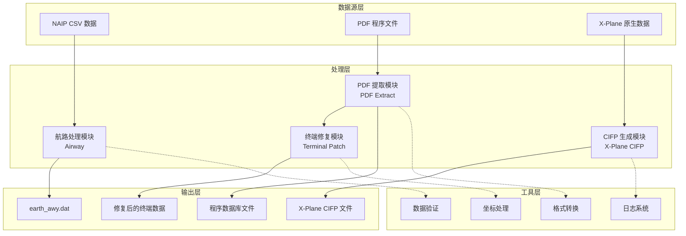
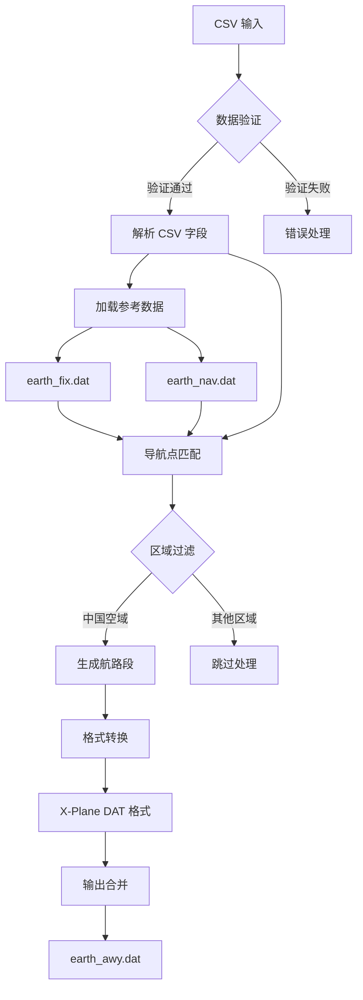
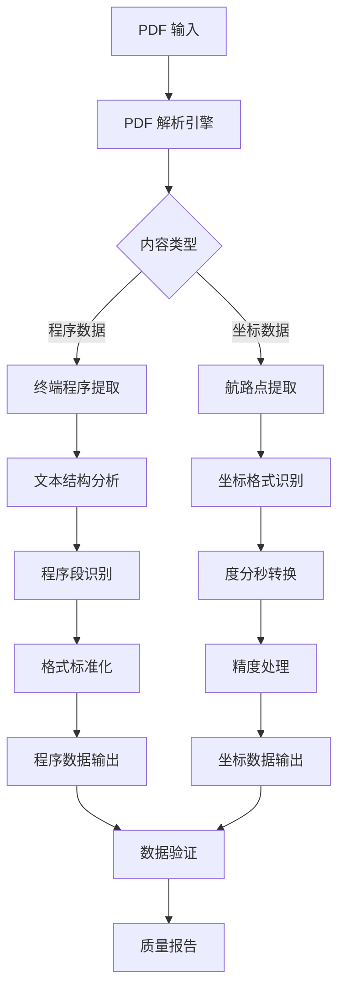
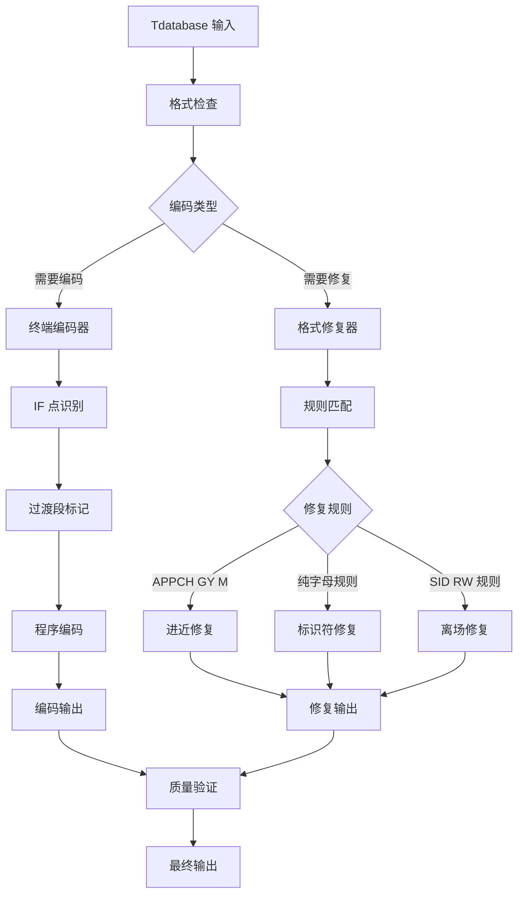
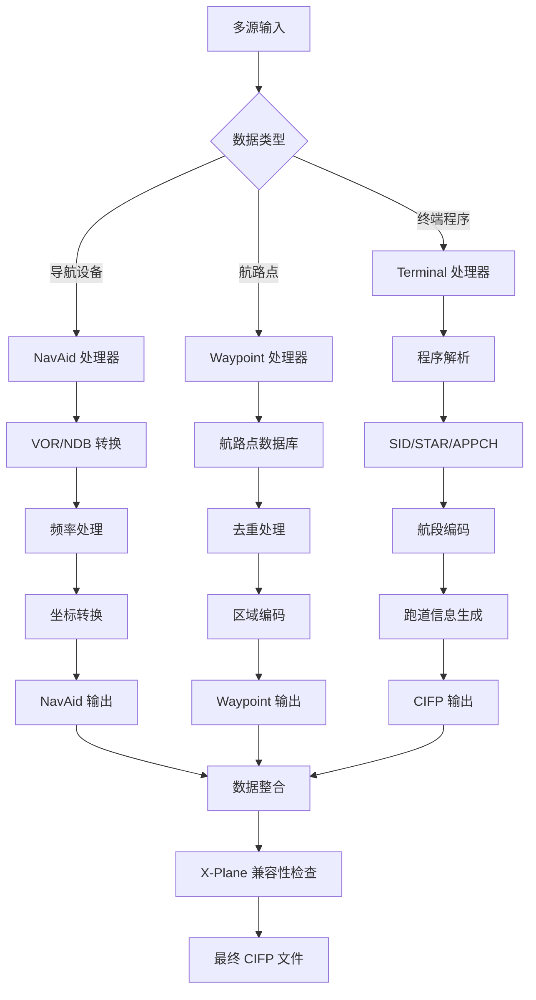
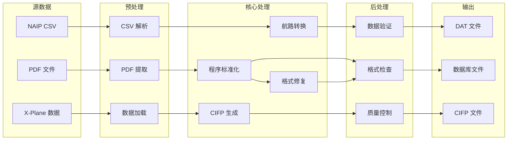
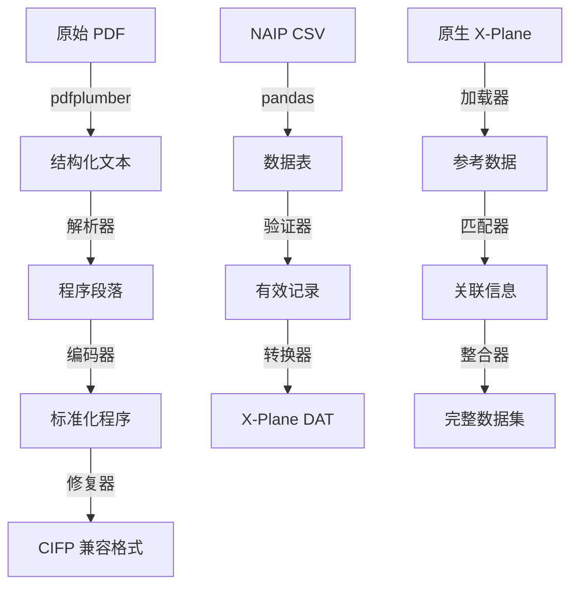
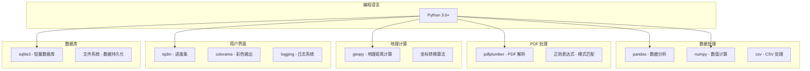
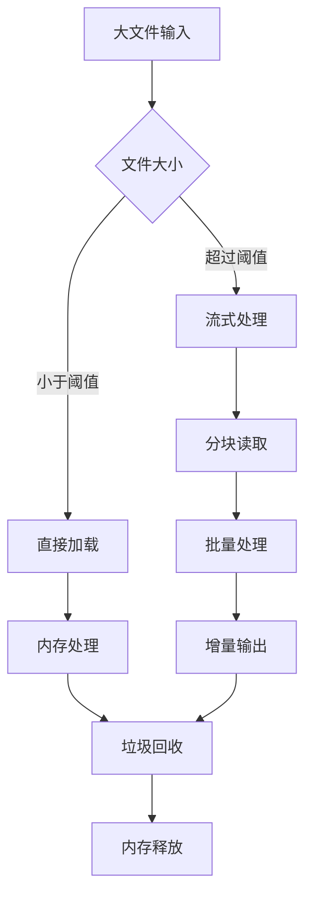
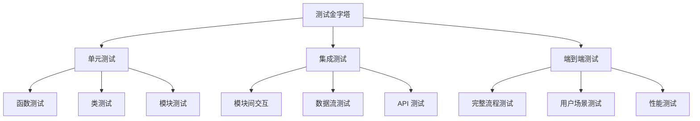

# 架构说明

本文档详细说明了 Nav-data 项目的系统架构、技术原理和设计思路。

## 🏗️ 总体架构

Nav-data 采用模块化设计，由四个核心模块组成，每个模块独立运行且可灵活组合使用。



## 📋 设计原则

### 1. 模块化设计
- **独立性**：每个模块可独立运行，不强依赖其他模块
- **可组合性**：模块间可灵活组合形成不同的处理流程
- **可扩展性**：新模块可无缝集成到现有架构中

### 2. 数据流驱动
- **单向数据流**：数据从源头流向目标，避免循环依赖
- **中间状态保存**：每个处理步骤都保存中间结果，便于调试和恢复
- **格式标准化**：统一的数据格式规范确保模块间兼容性

### 3. 容错与恢复
- **分步处理**：复杂任务分解为多个小步骤，降低失败风险
- **错误隔离**：单个文件的处理失败不影响整个批处理任务
- **状态保存**：关键状态信息持久化，支持断点续传

### 4. 性能优化
- **内存友好**：流式处理大文件，避免内存溢出
- **批量操作**：批量处理提高I/O效率
- **并发支持**：支持多线程/多进程并发处理

## 🛠️ 核心模块架构

### 航路处理模块 (Airway)



**技术特点：**
- **数据匹配算法**：基于标识符和坐标的智能匹配
- **区域过滤机制**：支持灵活的地理区域过滤配置
- **格式转换引擎**：CSV 到 X-Plane DAT 格式的精确转换
- **AIRAC 周期管理**：自动计算和管理航空数据有效周期

**核心类和接口：**
```python
class NavigationType(Enum):
    """导航点类型枚举"""
    DESIGNATED_POINT = ('DESIGNATED_POINT', '11')
    VORDME = ('VORDME', '3') 
    NDB = ('NDB', '2')

@dataclass
class NavigationPoint:
    """导航点数据结构"""
    identifier: str
    type: NavigationType
    area_code: str

def process_navigation_point(identifier: str, code_type: str, 
                           earth_fix_data: Dict, earth_nav_data: Dict) -> Optional[NavigationPoint]:
    """导航点处理核心算法"""
    pass

def convert_csv_to_dat(csv_file: str, earth_fix_path: str, 
                      earth_nav_path: str, earth_awy_path: str) -> None:
    """主要转换函数"""
    pass
```

### PDF 提取模块 (PDF Extract)



**技术特点：**
- **多层次解析**：支持文本、线条、表格等多种PDF元素
- **智能识别**：自动识别坐标格式和程序结构
- **容错机制**：处理PDF格式不一致和数据缺失问题
- **质量控制**：内置数据质量检查和报告机制

**核心组件：**
```python
class Line:
    """线条元素类"""
    def __init__(self, line: dict):
        self.is_horizontal = True if line["width"] > 5 else False
        self.top = line["top"]
        self.left = line["x0"]
        self.length = line["width"] if self.is_horizontal else line["height"]

class Word:
    """文本元素类"""
    def __init__(self, info: dict):
        self.content = info["text"]
        self.center = ((info["x0"] + info["x1"]) / 2, (info["top"] + info["bottom"]) / 2)

class Unit:
    """处理单元类"""
    def __init__(self):
        self.words = []
        self.lines = []
    
    def match_underline(self):
        """下划线匹配算法"""
        pass

def extract(pdf: pdfplumber.PDF) -> List[str]:
    """PDF 提取主函数"""
    pass
```

### 终端修复模块 (Terminal Patch)



**技术特点：**
- **规则引擎**：基于配置的修复规则引擎
- **模式识别**：智能识别不同类型的程序和标识符
- **批量处理**：支持文件夹级别的批量修复
- **向后兼容**：保持与现有数据格式的兼容性

**修复规则系统：**
```python
class FixRule:
    """修复规则基类"""
    def __init__(self, name: str, pattern: str, action: callable):
        self.name = name
        self.pattern = pattern
        self.action = action
    
    def apply(self, line: str) -> str:
        """应用修复规则"""
        pass

class RuleEngine:
    """规则引擎"""
    def __init__(self):
        self.rules = []
    
    def add_rule(self, rule: FixRule):
        """添加修复规则"""
        self.rules.append(rule)
    
    def apply_rules(self, content: str) -> str:
        """应用所有规则"""
        pass

# 预定义修复规则
APPCH_GY_M_RULE = FixRule(
    name="APPCH_GY_M",
    pattern=r"APPCH.*GY M",
    action=lambda line: fix_appch_gy_m(line)
)
```

### X-Plane CIFP 模块 (X-Plane CIFP)



**技术特点：**
- **多源数据整合**：整合 NAIP、X-Plane 原生数据等多个数据源
- **智能去重**：基于坐标和标识符的智能去重算法
- **版本兼容**：支持 X-Plane 11 和 X-Plane 12 格式
- **数据完整性**：确保生成的 CIFP 数据完整且符合标准

**核心数据结构：**
```python
class Waypoint:
    """航路点类"""
    def __init__(self, la: float, long: float, ident: str, cat: int, 
                 airport: str = '', area: str = '', changeable: bool = True):
        self.latitude = la
        self.longitude = long
        self.ident = ident
        self.cat = cat  # -1:不可用 1:航路点 2:VHF 3:NDB
        self.airport = airport
        self.area = area
        self.changeable = changeable
    
    def is_same(self, fix: "Waypoint", change: bool = False) -> bool:
        """判断是否为相同航路点"""
        pass

class WaypointSystem:
    """航路点管理系统"""
    def __init__(self):
        self.base = {}  # 主数据库
    
    def add_point(self, point: Waypoint):
        """添加航路点"""
        pass
    
    def query(self, point: Waypoint, change: bool = False) -> int:
        """查询航路点"""
        pass

class Procedure:
    """程序类"""
    def __init__(self, ptype: int):
        self.ptype = "SID" if ptype == 1 else ("STAR" if ptype == 2 else "APPCH")
        self.airport = None
        self.runway = None
        self.name = None
        self.legs = []
    
    def encode(self):
        """程序编码"""
        pass
    
    def output(self) -> str:
        """输出 CIFP 格式"""
        pass
```

## 🔄 数据流架构

### 数据流向图



### 数据格式转换链



## ⚙️ 技术栈架构

### 核心技术组件



### 依赖关系管理

```python
# requirements.txt 依赖层次
# 核心依赖
pandas>=1.3.0          # 数据处理基础
numpy>=1.21.0          # 数值计算基础

# PDF 处理
pdfplumber>=0.7.0      # PDF 解析引擎

# 用户体验
tqdm>=4.60.0           # 进度显示
colorama>=0.4.4        # 彩色输出

# 地理计算
geopy>=2.2.0           # 地理距离计算

# 中文处理
pypinyin>=0.44.0       # 中文拼音转换

# 开发工具（可选）
pytest>=6.0.0          # 测试框架
black>=21.0.0          # 代码格式化
flake8>=3.9.0          # 代码检查
```

## 🏛️ 设计模式

### 1. 工厂模式 (Factory Pattern)
用于创建不同类型的数据处理器：

```python
class ProcessorFactory:
    """数据处理器工厂"""
    
    @staticmethod
    def create_processor(data_type: str):
        if data_type == "airway":
            return AirwayProcessor()
        elif data_type == "pdf":
            return PDFProcessor()
        elif data_type == "terminal":
            return TerminalProcessor()
        elif data_type == "cifp":
            return CIFPProcessor()
        else:
            raise ValueError(f"Unknown processor type: {data_type}")

# 使用示例
processor = ProcessorFactory.create_processor("airway")
result = processor.process(input_data)
```

### 2. 策略模式 (Strategy Pattern)
用于实现不同的数据转换策略：

```python
class ConversionStrategy:
    """转换策略接口"""
    def convert(self, data): pass

class CSVToDAT(ConversionStrategy):
    """CSV 到 DAT 转换策略"""
    def convert(self, csv_data):
        # CSV 转换逻辑
        pass

class PDFToText(ConversionStrategy):
    """PDF 到文本转换策略"""
    def convert(self, pdf_data):
        # PDF 转换逻辑
        pass

class DataConverter:
    """数据转换器"""
    def __init__(self, strategy: ConversionStrategy):
        self.strategy = strategy
    
    def convert(self, data):
        return self.strategy.convert(data)
```

### 3. 观察者模式 (Observer Pattern)
用于实现处理进度监控：

```python
class ProgressObserver:
    """进度观察者接口"""
    def update(self, progress: float, message: str): pass

class ConsoleProgressObserver(ProgressObserver):
    """控制台进度显示"""
    def update(self, progress: float, message: str):
        print(f"Progress: {progress:.1%} - {message}")

class TqdmProgressObserver(ProgressObserver):
    """tqdm 进度条显示"""
    def __init__(self):
        self.pbar = None
    
    def update(self, progress: float, message: str):
        if self.pbar:
            self.pbar.set_description(message)
            self.pbar.update()

class DataProcessor:
    """数据处理器基类"""
    def __init__(self):
        self.observers = []
    
    def add_observer(self, observer: ProgressObserver):
        self.observers.append(observer)
    
    def notify_progress(self, progress: float, message: str):
        for observer in self.observers:
            observer.update(progress, message)
```

### 4. 责任链模式 (Chain of Responsibility)
用于实现数据验证链：

```python
class ValidationHandler:
    """验证处理器接口"""
    def __init__(self):
        self.next_handler = None
    
    def set_next(self, handler):
        self.next_handler = handler
        return handler
    
    def handle(self, data):
        result = self.validate(data)
        if result and self.next_handler:
            return self.next_handler.handle(data)
        return result
    
    def validate(self, data):
        pass

class FormatValidator(ValidationHandler):
    """格式验证器"""
    def validate(self, data):
        # 格式验证逻辑
        return True

class RangeValidator(ValidationHandler):
    """范围验证器"""
    def validate(self, data):
        # 范围验证逻辑
        return True

class IntegrityValidator(ValidationHandler):
    """完整性验证器"""
    def validate(self, data):
        # 完整性验证逻辑
        return True

# 构建验证链
format_validator = FormatValidator()
range_validator = RangeValidator()
integrity_validator = IntegrityValidator()

format_validator.set_next(range_validator).set_next(integrity_validator)

# 使用验证链
is_valid = format_validator.handle(input_data)
```

## 📊 性能架构

### 内存管理策略



**内存优化策略：**
```python
import gc
from typing import Iterator, List

class MemoryEfficientProcessor:
    """内存高效的数据处理器"""
    
    def __init__(self, chunk_size: int = 1000):
        self.chunk_size = chunk_size
    
    def process_large_file(self, file_path: str) -> Iterator[List]:
        """分块处理大文件"""
        chunk = []
        with open(file_path, 'r', encoding='utf-8') as f:
            for line in f:
                chunk.append(line.strip())
                
                if len(chunk) >= self.chunk_size:
                    yield self.process_chunk(chunk)
                    chunk.clear()
                    gc.collect()  # 强制垃圾回收
            
            if chunk:  # 处理剩余数据
                yield self.process_chunk(chunk)
    
    def process_chunk(self, chunk: List[str]) -> List[str]:
        """处理单个数据块"""
        # 数据处理逻辑
        return [self.process_line(line) for line in chunk]
    
    def process_line(self, line: str) -> str:
        """处理单行数据"""
        # 具体处理逻辑
        return line
```

### 并发处理架构

```python
import concurrent.futures
from multiprocessing import Pool
import threading

class ConcurrentProcessor:
    """并发数据处理器"""
    
    def __init__(self, max_workers: int = 4):
        self.max_workers = max_workers
    
    def process_files_threaded(self, file_list: List[str]) -> List:
        """多线程处理文件列表"""
        with concurrent.futures.ThreadPoolExecutor(max_workers=self.max_workers) as executor:
            # 提交任务
            future_to_file = {
                executor.submit(self.process_single_file, file): file 
                for file in file_list
            }
            
            results = []
            for future in concurrent.futures.as_completed(future_to_file):
                file = future_to_file[future]
                try:
                    result = future.result()
                    results.append(result)
                except Exception as exc:
                    print(f'File {file} generated an exception: {exc}')
            
            return results
    
    def process_files_multiprocess(self, file_list: List[str]) -> List:
        """多进程处理文件列表"""
        with Pool(processes=self.max_workers) as pool:
            results = pool.map(self.process_single_file, file_list)
        return results
    
    def process_single_file(self, file_path: str):
        """处理单个文件"""
        # 文件处理逻辑
        pass
```

### 缓存架构

```python
import functools
import hashlib
import pickle
from pathlib import Path

class CacheManager:
    """缓存管理器"""
    
    def __init__(self, cache_dir: str = "cache"):
        self.cache_dir = Path(cache_dir)
        self.cache_dir.mkdir(exist_ok=True)
    
    def get_cache_key(self, *args, **kwargs) -> str:
        """生成缓存键"""
        content = str(args) + str(sorted(kwargs.items()))
        return hashlib.md5(content.encode()).hexdigest()
    
    def get(self, key: str):
        """获取缓存"""
        cache_file = self.cache_dir / f"{key}.cache"
        if cache_file.exists():
            with open(cache_file, 'rb') as f:
                return pickle.load(f)
        return None
    
    def set(self, key: str, value):
        """设置缓存"""
        cache_file = self.cache_dir / f"{key}.cache"
        with open(cache_file, 'wb') as f:
            pickle.dump(value, f)
    
    def cached(self, ttl: int = 3600):
        """缓存装饰器"""
        def decorator(func):
            @functools.wraps(func)
            def wrapper(*args, **kwargs):
                cache_key = self.get_cache_key(func.__name__, *args, **kwargs)
                result = self.get(cache_key)
                
                if result is None:
                    result = func(*args, **kwargs)
                    self.set(cache_key, result)
                
                return result
            return wrapper
        return decorator

# 使用示例
cache_manager = CacheManager()

@cache_manager.cached(ttl=3600)
def expensive_processing(data):
    """耗时的数据处理函数"""
    # 复杂处理逻辑
    return processed_data
```

## 🔒 安全架构

### 输入验证层

```python
import re
from pathlib import Path
from typing import Any, Dict

class InputValidator:
    """输入验证器"""
    
    # 安全的文件扩展名
    SAFE_EXTENSIONS = {'.csv', '.dat', '.txt', '.pdf'}
    
    # 路径限制模式
    SAFE_PATH_PATTERN = re.compile(r'^[a-zA-Z0-9._/\-\s]+$')
    
    @classmethod
    def validate_file_path(cls, file_path: str) -> bool:
        """验证文件路径安全性"""
        path = Path(file_path)
        
        # 检查文件扩展名
        if path.suffix.lower() not in cls.SAFE_EXTENSIONS:
            raise ValueError(f"Unsafe file extension: {path.suffix}")
        
        # 检查路径字符
        if not cls.SAFE_PATH_PATTERN.match(file_path):
            raise ValueError(f"Unsafe characters in path: {file_path}")
        
        # 检查路径遍历攻击
        if '..' in file_path or file_path.startswith('/'):
            raise ValueError(f"Path traversal detected: {file_path}")
        
        return True
    
    @classmethod
    def validate_coordinate(cls, lat: float, lon: float) -> bool:
        """验证坐标范围"""
        if not (-90 <= lat <= 90):
            raise ValueError(f"Invalid latitude: {lat}")
        
        if not (-180 <= lon <= 180):
            raise ValueError(f"Invalid longitude: {lon}")
        
        return True
    
    @classmethod
    def sanitize_string(cls, input_str: str) -> str:
        """清理输入字符串"""
        # 移除潜在危险字符
        sanitized = re.sub(r'[<>"\';\\]', '', input_str)
        # 限制长度
        return sanitized[:1000]
```

### 错误处理架构

```python
import logging
from enum import Enum
from typing import Optional

class ErrorLevel(Enum):
    """错误级别"""
    WARNING = "WARNING"
    ERROR = "ERROR"
    CRITICAL = "CRITICAL"

class NavDataError(Exception):
    """Nav-data 自定义异常基类"""
    def __init__(self, message: str, error_code: str = None, level: ErrorLevel = ErrorLevel.ERROR):
        super().__init__(message)
        self.message = message
        self.error_code = error_code
        self.level = level

class FileProcessingError(NavDataError):
    """文件处理异常"""
    pass

class DataValidationError(NavDataError):
    """数据验证异常"""
    pass

class ErrorHandler:
    """错误处理器"""
    
    def __init__(self):
        self.logger = logging.getLogger(__name__)
    
    def handle_error(self, error: Exception, context: Optional[Dict] = None):
        """处理异常"""
        if isinstance(error, NavDataError):
            self.handle_nav_data_error(error, context)
        else:
            self.handle_unexpected_error(error, context)
    
    def handle_nav_data_error(self, error: NavDataError, context: Optional[Dict] = None):
        """处理自定义异常"""
        log_message = f"[{error.error_code}] {error.message}"
        if context:
            log_message += f" Context: {context}"
        
        if error.level == ErrorLevel.WARNING:
            self.logger.warning(log_message)
        elif error.level == ErrorLevel.ERROR:
            self.logger.error(log_message)
        elif error.level == ErrorLevel.CRITICAL:
            self.logger.critical(log_message)
            # 可能需要停止程序执行
    
    def handle_unexpected_error(self, error: Exception, context: Optional[Dict] = None):
        """处理未预期的异常"""
        log_message = f"Unexpected error: {str(error)}"
        if context:
            log_message += f" Context: {context}"
        
        self.logger.error(log_message, exc_info=True)
```

## 🧪 测试架构

### 测试策略



### 测试框架代码

```python
import pytest
import tempfile
from pathlib import Path
from unittest.mock import Mock, patch

class TestDataFixtures:
    """测试数据装置"""
    
    @pytest.fixture
    def sample_csv_data(self):
        """示例 CSV 数据"""
        return """CODE_POINT_START,CODE_TYPE_START,CODE_POINT_END,CODE_TYPE_END,CODE_DIR,TXT_DESIG
ABCDE,DESIGNATED_POINT,FGHIJ,VOR/DME,N,A123
KLMNO,NDB,PQRST,DESIGNATED_POINT,N,B456"""
    
    @pytest.fixture
    def temp_directory(self):
        """临时目录"""
        with tempfile.TemporaryDirectory() as temp_dir:
            yield Path(temp_dir)
    
    @pytest.fixture
    def mock_earth_fix_data(self):
        """模拟 earth_fix 数据"""
        return {
            'ABCDE': 'ZB',
            'PQRST': 'ZG'
        }
    
    @pytest.fixture
    def mock_earth_nav_data(self):
        """模拟 earth_nav 数据"""
        return {
            'FGHIJ': 'ZG',
            'KLMNO': 'ZB'
        }

class TestAirwayModule(TestDataFixtures):
    """航路模块测试"""
    
    def test_navigation_type_enum(self):
        """测试导航类型枚举"""
        from Airway.airway import NavigationType
        
        assert NavigationType.DESIGNATED_POINT.type_code == '11'
        assert NavigationType.VORDME.type_code == '3'
        assert NavigationType.NDB.type_code == '2'
    
    def test_process_navigation_point(self, mock_earth_fix_data, mock_earth_nav_data):
        """测试导航点处理"""
        from Airway.airway import process_navigation_point
        
        # 测试指定点处理
        result = process_navigation_point(
            'ABCDE', 'DESIGNATED_POINT', 
            mock_earth_fix_data, mock_earth_nav_data
        )
        
        assert result is not None
        assert result.identifier == 'ABCDE'
        assert result.area_code == 'ZB'
    
    @patch('Airway.airway.load_fixed_width_data')
    @patch('pandas.read_csv')
    def test_csv_to_dat_conversion(self, mock_read_csv, mock_load_data, 
                                 sample_csv_data, temp_directory):
        """测试 CSV 到 DAT 转换"""
        # 设置模拟数据
        mock_df = Mock()
        mock_read_csv.return_value = mock_df
        mock_load_data.return_value = {'ABCDE': 'ZB'}
        
        # 创建临时文件
        csv_file = temp_directory / "test.csv"
        csv_file.write_text(sample_csv_data)
        
        # 测试转换功能
        from Airway.airway import convert_csv_to_dat
        
        # 这里需要根据实际函数签名调整
        # convert_csv_to_dat(str(csv_file), ...)
        
        # 验证结果
        assert True  # 根据实际结果进行断言

class TestPDFModule(TestDataFixtures):
    """PDF 模块测试"""
    
    @patch('pdfplumber.open')
    def test_pdf_extraction(self, mock_pdf_open):
        """测试 PDF 提取功能"""
        # 设置模拟 PDF
        mock_pdf = Mock()
        mock_page = Mock()
        mock_page.extract_text_lines.return_value = [
            {'text': 'ZBAA N39°48\'35.6" E116°34\'46.7"'}
        ]
        mock_pdf.pages = [mock_page]
        mock_pdf_open.return_value.__enter__.return_value = mock_pdf
        
        # 测试提取功能
        import sys
        sys.path.append('PDF extract')
        from waypoint_1_pdf import extract
        
        result = extract(mock_pdf)
        assert len(result) > 0
```

## 📈 监控和日志架构

### 日志系统设计

```python
import logging
import logging.handlers
from enum import Enum
from pathlib import Path

class LogLevel(Enum):
    """日志级别"""
    DEBUG = logging.DEBUG
    INFO = logging.INFO
    WARNING = logging.WARNING
    ERROR = logging.ERROR
    CRITICAL = logging.CRITICAL

class StructuredLogger:
    """结构化日志器"""
    
    def __init__(self, name: str, log_dir: str = "logs"):
        self.logger = logging.getLogger(name)
        self.log_dir = Path(log_dir)
        self.log_dir.mkdir(exist_ok=True)
        
        self.setup_handlers()
    
    def setup_handlers(self):
        """设置日志处理器"""
        # 控制台处理器
        console_handler = logging.StreamHandler()
        console_formatter = logging.Formatter(
            '%(asctime)s - %(name)s - %(levelname)s - %(message)s'
        )
        console_handler.setFormatter(console_formatter)
        
        # 文件处理器（按日期轮转）
        file_handler = logging.handlers.TimedRotatingFileHandler(
            filename=self.log_dir / 'nav-data.log',
            when='midnight',
            interval=1,
            backupCount=30,
            encoding='utf-8'
        )
        file_formatter = logging.Formatter(
            '%(asctime)s - %(name)s - %(levelname)s - %(filename)s:%(lineno)d - %(message)s'
        )
        file_handler.setFormatter(file_formatter)
        
        # 错误文件处理器
        error_handler = logging.FileHandler(
            filename=self.log_dir / 'errors.log',
            encoding='utf-8'
        )
        error_handler.setLevel(logging.ERROR)
        error_handler.setFormatter(file_formatter)
        
        # 添加处理器
        self.logger.addHandler(console_handler)
        self.logger.addHandler(file_handler)
        self.logger.addHandler(error_handler)
        
        self.logger.setLevel(logging.INFO)
    
    def log_with_context(self, level: LogLevel, message: str, **context):
        """带上下文的日志记录"""
        if context:
            message = f"{message} | Context: {context}"
        
        self.logger.log(level.value, message)
    
    def log_performance(self, operation: str, duration: float, **metrics):
        """性能日志"""
        perf_message = f"Performance | Operation: {operation} | Duration: {duration:.3f}s"
        if metrics:
            perf_message += f" | Metrics: {metrics}"
        
        self.logger.info(perf_message)
```

### 性能监控

```python
import time
import psutil
from contextlib import contextmanager
from typing import Dict, Any

class PerformanceMonitor:
    """性能监控器"""
    
    def __init__(self, logger: StructuredLogger):
        self.logger = logger
        self.metrics = {}
    
    @contextmanager
    def measure_time(self, operation_name: str):
        """测量操作耗时"""
        start_time = time.time()
        start_memory = psutil.Process().memory_info().rss / 1024 / 1024  # MB
        
        try:
            yield
        finally:
            end_time = time.time()
            end_memory = psutil.Process().memory_info().rss / 1024 / 1024  # MB
            
            duration = end_time - start_time
            memory_delta = end_memory - start_memory
            
            self.logger.log_performance(
                operation=operation_name,
                duration=duration,
                memory_start=start_memory,
                memory_end=end_memory,
                memory_delta=memory_delta
            )
    
    def collect_system_metrics(self) -> Dict[str, Any]:
        """收集系统指标"""
        return {
            'cpu_percent': psutil.cpu_percent(),
            'memory_percent': psutil.virtual_memory().percent,
            'disk_usage': psutil.disk_usage('/').percent,
            'process_memory': psutil.Process().memory_info().rss / 1024 / 1024
        }

# 使用示例
logger = StructuredLogger("nav-data")
monitor = PerformanceMonitor(logger)

with monitor.measure_time("csv_processing"):
    # 执行 CSV 处理操作
    process_csv_file("large_file.csv")

# 记录系统指标
system_metrics = monitor.collect_system_metrics()
logger.log_with_context(LogLevel.INFO, "System metrics collected", **system_metrics)
```

## 🔮 扩展架构

### 插件系统设计

```python
from abc import ABC, abstractmethod
from typing import Dict, Any, List
import importlib
import os

class Plugin(ABC):
    """插件接口"""
    
    @property
    @abstractmethod
    def name(self) -> str:
        """插件名称"""
        pass
    
    @property
    @abstractmethod
    def version(self) -> str:
        """插件版本"""
        pass
    
    @abstractmethod
    def initialize(self, config: Dict[str, Any]):
        """初始化插件"""
        pass
    
    @abstractmethod
    def process(self, data: Any) -> Any:
        """处理数据"""
        pass
    
    @abstractmethod
    def cleanup(self):
        """清理资源"""
        pass

class PluginManager:
    """插件管理器"""
    
    def __init__(self, plugin_dir: str = "plugins"):
        self.plugin_dir = plugin_dir
        self.plugins: Dict[str, Plugin] = {}
    
    def load_plugins(self):
        """加载所有插件"""
        if not os.path.exists(self.plugin_dir):
            return
        
        for filename in os.listdir(self.plugin_dir):
            if filename.endswith('.py') and not filename.startswith('__'):
                module_name = filename[:-3]
                try:
                    module = importlib.import_module(f"{self.plugin_dir}.{module_name}")
                    plugin_class = getattr(module, 'Plugin', None)
                    
                    if plugin_class and issubclass(plugin_class, Plugin):
                        plugin = plugin_class()
                        self.plugins[plugin.name] = plugin
                        print(f"Loaded plugin: {plugin.name} v{plugin.version}")
                
                except Exception as e:
                    print(f"Failed to load plugin {module_name}: {e}")
    
    def get_plugin(self, name: str) -> Plugin:
        """获取插件"""
        return self.plugins.get(name)
    
    def list_plugins(self) -> List[str]:
        """列出所有插件"""
        return list(self.plugins.keys())
    
    def execute_plugin(self, name: str, data: Any, config: Dict[str, Any] = None) -> Any:
        """执行插件"""
        plugin = self.get_plugin(name)
        if not plugin:
            raise ValueError(f"Plugin not found: {name}")
        
        try:
            if config:
                plugin.initialize(config)
            
            result = plugin.process(data)
            plugin.cleanup()
            return result
        
        except Exception as e:
            plugin.cleanup()
            raise e

# 示例插件实现
class CustomDataProcessor(Plugin):
    """自定义数据处理插件"""
    
    @property
    def name(self) -> str:
        return "custom_processor"
    
    @property
    def version(self) -> str:
        return "1.0.0"
    
    def initialize(self, config: Dict[str, Any]):
        self.config = config
    
    def process(self, data: Any) -> Any:
        # 自定义处理逻辑
        return processed_data
    
    def cleanup(self):
        # 清理资源
        pass
```

---

**总结**：Nav-data 采用模块化、分层的架构设计，确保了系统的可维护性、可扩展性和性能。通过合理的设计模式应用、完善的错误处理机制和监控系统，为用户提供了稳定可靠的航空导航数据转换服务。 ✈️ 