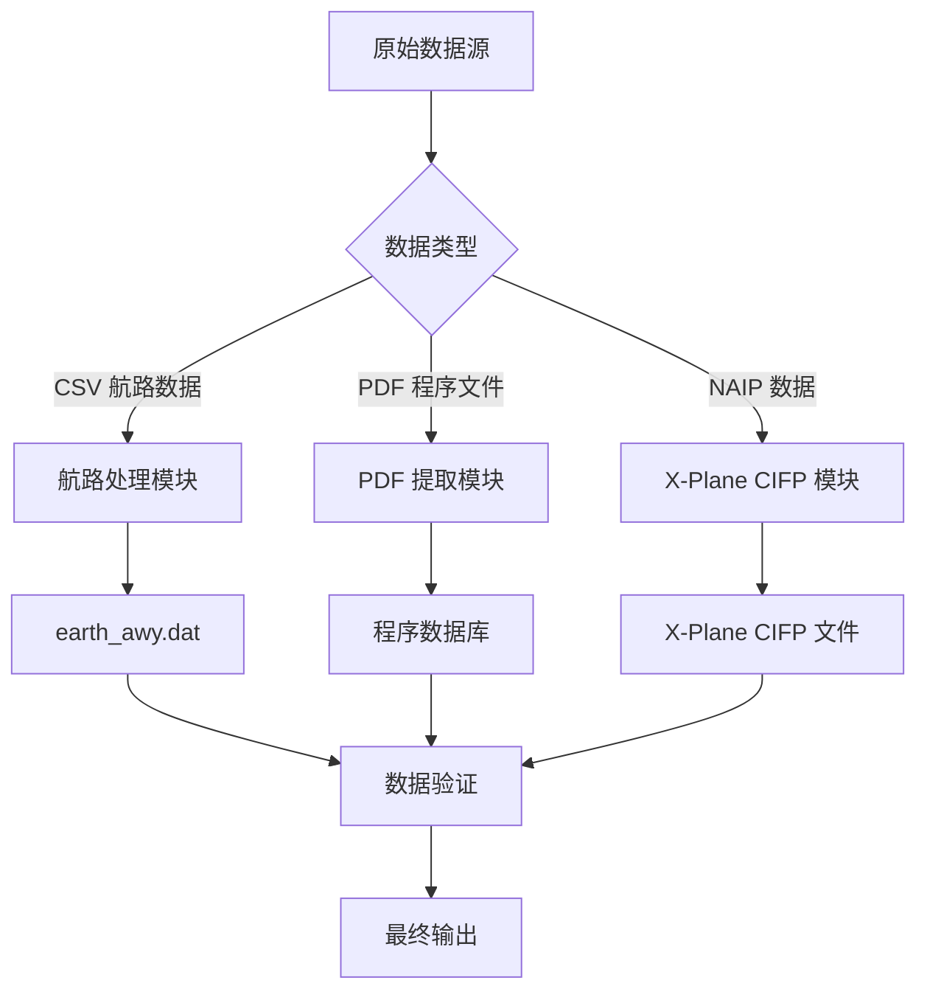

# 使用说明

本文档详细介绍如何使用 Nav-data 工具进行航空导航数据转换，涵盖从数据准备到最终输出的完整流程。

## 🗂️ 数据处理流程概览

Nav-data 包含三个主要的数据处理流程：



## 🛣️ 航路数据处理

### 数据准备

#### 1. 准备输入文件
确保以下文件在工作目录中：

```bash
# 必需的输入文件
RTE_SEG.csv          # 航路段数据（CSV格式）
earth_fix.dat        # X-Plane 修正点数据
earth_nav.dat        # X-Plane 导航设备数据
earth_awy.dat        # X-Plane 航路数据（将被更新）
```

#### 2. CSV 文件格式验证
`RTE_SEG.csv` 必须包含以下字段：

| 字段名 | 说明 | 示例 |
|--------|------|------|
| `CODE_POINT_START` | 起始点代码 | ABCDE |
| `CODE_TYPE_START` | 起始点类型 | DESIGNATED_POINT |
| `CODE_POINT_END` | 终点代码 | FGHIJ |
| `CODE_TYPE_END` | 终点类型 | VOR/DME |
| `CODE_DIR` | 方向代码 | N |
| `TXT_DESIG` | 航路名称 | A123 |

### 执行航路转换

#### 基本使用
```bash
# 进入航路模块目录
cd Airway

# 运行转换脚本
python airway.py
```

#### 高级使用
```bash
# 使用自定义参数
python airway.py --config custom_config.ini

# 指定特定的输入文件
python airway.py --csv-file /path/to/custom_routes.csv

# 启用详细日志
python airway.py --verbose

# 仅处理特定区域
python airway.py --areas ZB,ZG,ZY
```

#### 脚本内配置修改
如需修改处理参数，编辑 `Airway/airway.py`：

```python
# 修改过滤区域
china_areas = {'ZB', 'ZG', 'ZY', 'ZS', 'ZW', 'ZJ', 'ZP', 'ZL', 'ZH', 'ZU'}

# 修改文件路径
csv_file = 'custom_routes.csv'
earth_fix_path = '/path/to/earth_fix.dat'
earth_nav_path = '/path/to/earth_nav.dat'
earth_awy_path = '/path/to/earth_awy.dat'
```

### 输出文件说明

处理完成后，`earth_awy.dat` 文件将包含：
- 过滤后的原始航路数据
- 新添加的中国空域航路数据
- 符合 X-Plane 格式的航路信息

输出格式示例：
```
ABCDE  ZB  11 FGHIJ  ZG   3 N  1    0  600 A123
```

## 📄 PDF 数据提取

### 程序数据处理流程

#### 流程 1：PDF 原始提取
```bash
# 进入 PDF 提取目录
cd "PDF extract"

# 运行 PDF 提取脚本
python 1_terminal_pdf.py

# 输入：airport_procedures.pdf
# 输出：ZXXX_procedure.txt
```

**使用示例：**
```python
# 自定义 PDF 处理
import pdfplumber
from utils import *

# 打开 PDF 文件
with pdfplumber.open("ZBAA_procedures.pdf") as pdf:
    # 提取文本和图形元素
    extracted_data = extract(pdf)
    
    # 保存提取结果
    with open("ZBAA_procedure.txt", "w", encoding="utf-8") as f:
        for line in extracted_data:
            f.write(line + "\n")
```

#### 流程 2：数据标准化编码
```bash
# 运行编码脚本
python 2_terminal_encode.py

# 输入：ZXXX_procedure.txt
# 输出：ZXXX_encode.txt
```

**编码规则：**
- 清理无效字符和格式
- 标准化程序名称
- 规范坐标格式
- 验证数据完整性

#### 流程 3：数据库格式生成
```bash
# 运行数据库生成脚本
python 3_terminal_db.py

# 输入：ZXXX_encode.txt  
# 输出：ZXXX_db.txt
```

**数据库格式特性：**
- 分离多跑道程序
- 拼接过渡、复飞、等待程序
- 生成 X-Plane 兼容格式
- 添加程序描述编码

#### 流程 4：程序增殖（可选）
```bash
# 修正程序名称不一致问题
python 4_程序增殖.py

# 输入：ZXXX_db.txt
# 输出：修正后的程序文件
```

### 航路点坐标提取流程

#### 自动提取（推荐）
```bash
# 运行自动坐标提取
python waypoint_1_pdf.py

# 配置输入输出路径
input_pdf = "ZBAA_waypoints.pdf"
output_txt = "ZBAA_waypoint.txt"
```

**自动提取特性：**
- 智能识别坐标格式
- 自动处理度分秒转换
- 支持多种 PDF 布局
- 包含数据验证

#### 手动提取（备用方案）
当自动提取精度不理想时：

```bash
# 使用 Edge 浏览器手动提取
python waypoint_2_edge.py
```

**手动提取步骤：**
1. 用 Microsoft Edge 打开 PDF 文件
2. 右键选择并复制相关文本
3. 将文本保存到输入文件
4. 运行脚本进行格式化处理

#### 单文件处理（特殊情况）
```bash
# 处理包含特殊字符的文件
python debug_single.py

# 适用于：
# - 包含括号等特殊字符的文件
# - 需要手动修正的数据
# - 单独处理的机场文件
```

### PDF 处理最佳实践

#### 1. PDF 文件预处理
```bash
# 检查 PDF 文件质量
python -c "
import pdfplumber
with pdfplumber.open('input.pdf') as pdf:
    print(f'页数: {len(pdf.pages)}')
    print(f'首页文本行数: {len(pdf.pages[0].extract_text_lines())}')
"
```

#### 2. 批量处理
```python
# 批量处理多个机场 PDF
import os
from pathlib import Path

pdf_folder = "input_pdfs/"
output_folder = "output_txt/"

for pdf_file in Path(pdf_folder).glob("*.pdf"):
    airport_code = pdf_file.stem[:4]  # 提取机场代码
    
    # 处理单个文件
    os.system(f"python 1_terminal_pdf.py {pdf_file}")
    os.system(f"python 2_terminal_encode.py {airport_code}_procedure.txt")
    os.system(f"python 3_terminal_db.py {airport_code}_encode.txt")
    
    print(f"完成处理: {airport_code}")
```

#### 3. 质量检查
```python
# 验证提取结果
def validate_extraction(output_file):
    with open(output_file, 'r', encoding='utf-8') as f:
        lines = f.readlines()
    
    # 检查坐标格式
    coord_pattern = r'\d+\.\d{8}'
    valid_coords = sum(1 for line in lines if re.search(coord_pattern, line))
    
    print(f"文件: {output_file}")
    print(f"总行数: {len(lines)}")
    print(f"有效坐标行数: {valid_coords}")
    print(f"数据质量: {valid_coords/len(lines)*100:.1f}%")

# 使用示例
validate_extraction("ZBAA_waypoint.txt")
```

## 🔧 终端程序修复

### 数据编码修复

#### 使用编码器
```bash
# 进入修复模块目录
cd "Terminal Patch"

# 批量处理（默认路径）
python terminal_encoder.py

# 自定义路径处理
python terminal_encoder.py "input_folder" "output_folder"

# 示例
python terminal_encoder.py "PDF extract/public" "PDF extract/encoded"
```

**编码器功能：**
- 识别 IF 点位置
- 添加过渡段编码
- 标记程序关键点
- 生成标准描述代码

#### 使用格式修复器
```bash
# 批量格式修复（默认路径）
python terminal_reencode.py

# 单文件处理
python terminal_reencode.py ZBAA.dat ZBAA_fixed.dat

# 指定输入输出文件夹
python terminal_reencode.py "/input/folder" "/output/folder"
```

**修复规则说明：**

1. **APPCH 行 GY M 规则**
   ```
   修复前: APPCH ... RW01 ... ... GY M
   修复后: APPCH ... RW01 ... G GY M
   ```

2. **纯字母第五部分规则**
   ```
   修复前: SID ... ABC ... ... EY M
   修复后: SID ... ABC ... D B VY M
   ```

3. **SID RW 规则**
   ```
   修复前: SID ... RW25 ... ... EY D
   修复后: SID ... RW25 ... G GY D
   ```

### 自定义修复脚本

```python
# 创建自定义修复脚本
import re

def custom_fix_procedure(input_file, output_file):
    """自定义程序修复函数"""
    with open(input_file, 'r', encoding='utf-8') as f:
        lines = f.readlines()
    
    fixed_lines = []
    for line in lines:
        # 应用自定义修复规则
        if line.startswith('APPCH'):
            # 自定义进近程序修复
            parts = line.split()
            if len(parts) >= 9:
                # 修复逻辑
                if parts[8] == 'EY':
                    parts[8] = 'GY'
                line = ' '.join(parts) + '\n'
        
        fixed_lines.append(line)
    
    with open(output_file, 'w', encoding='utf-8') as f:
        f.writelines(fixed_lines)

# 使用示例
custom_fix_procedure('ZBAA.dat', 'ZBAA_custom_fixed.dat')
```

## 🛩️ X-Plane CIFP 生成

### 导航设备处理

#### VOR/DME 和 NDB 数据处理
```bash
cd "X-Plane CIFP"

# 处理导航设备数据
python 1_navaid.py
```

**配置路径：**
```python
# 修改脚本中的路径配置
nav路径 = "path/to/earth_nav.dat"
vor路径 = "path/to/VOR.csv"
ndb路径 = "path/to/NDB.csv"
```

**CSV 数据格式要求：**

VOR.csv 字段：
- 机场代码、名称、频率、坐标、高度等

NDB.csv 字段：
- 机场代码、名称、频率、坐标、高度等

### 航路点处理

```bash
# 处理航路点数据
python 2_waypoint.py
```

**配置示例：**
```python
# 修改路径配置
naipPath = "path/to/naip/waypoints"
xplanePath = "path/to/xplane/data"
outputPath = "path/to/output/earth_fix.dat"

# 选择 X-Plane 版本
forXp11 = False  # True for X-Plane 11, False for X-Plane 12
```

### 终端程序处理

```bash
# 处理终端程序数据
python 3_terminal.py
```

**配置路径：**
```python
# 主要路径配置
inputPath = "path/to/encoded/procedures"
outputFolder = "path/to/cifp/output"
xplanePath = "path/to/xplane/installation"
csvFolder = "path/to/naip/csv/data"
```

**处理流程：**
1. 读取编码后的程序文件
2. 建立航路点数据库
3. 处理 SID、STAR、进近程序
4. 生成跑道信息
5. 输出 CIFP 格式文件

### 特殊功能模块

#### Fenix 数据提取
```bash
# 提取特定格式的跑道和 MAP 信息
python Fenix.py

# 配置参数
csv_folder = "path/to/csv/data"
procedure_folder = "path/to/procedures"
output_file = "fenix_output.txt"
```

#### 跑道生成
```bash
# 生成跑道相关数据
python spawn_runway.py

# 或使用导出版本
python 跑道生成导出ver.py
```

## 📊 数据验证和质量控制

### 自动验证脚本

创建 `validate_output.py`：

```python
#!/usr/bin/env python3
"""
输出数据验证脚本
"""
import re
import os
from pathlib import Path

def validate_airway_data(file_path):
    """验证航路数据格式"""
    errors = []
    with open(file_path, 'r', encoding='utf-8') as f:
        for line_num, line in enumerate(f, 1):
            line = line.strip()
            if not line or line == "99":
                continue
                
            # X-Plane 航路格式验证
            parts = line.split()
            if len(parts) < 11:
                errors.append(f"行 {line_num}: 字段数不足")
                continue
                
            # 坐标范围验证
            try:
                # 这里添加具体的坐标验证逻辑
                pass
            except ValueError as e:
                errors.append(f"行 {line_num}: 坐标格式错误 - {e}")
    
    return errors

def validate_waypoint_data(file_path):
    """验证航路点数据格式"""
    errors = []
    coord_pattern = r'^-?\d+\.\d{8}$'
    
    with open(file_path, 'r', encoding='utf-8') as f:
        for line_num, line in enumerate(f, 1):
            line = line.strip()
            if not line:
                continue
                
            parts = line.split()
            if len(parts) < 3:
                errors.append(f"行 {line_num}: 字段数不足")
                continue
                
            # 验证坐标格式
            try:
                lat, lon = float(parts[1]), float(parts[2])
                if not (-90 <= lat <= 90):
                    errors.append(f"行 {line_num}: 纬度超出范围")
                if not (-180 <= lon <= 180):
                    errors.append(f"行 {line_num}: 经度超出范围")
            except ValueError:
                errors.append(f"行 {line_num}: 坐标格式错误")
    
    return errors

def validate_cifp_data(file_path):
    """验证 CIFP 数据格式"""
    errors = []
    procedure_types = ['SID', 'STAR', 'APPCH']
    
    with open(file_path, 'r', encoding='utf-8') as f:
        for line_num, line in enumerate(f, 1):
            line = line.strip()
            if not line:
                continue
                
            # 检查程序类型
            if any(line.startswith(ptype) for ptype in procedure_types):
                parts = line.split()
                if len(parts) < 15:
                    errors.append(f"行 {line_num}: CIFP 格式字段不足")
    
    return errors

def main():
    """主验证函数"""
    print("🔍 Nav-data 输出验证")
    print("=" * 40)
    
    # 验证配置
    validation_config = {
        'earth_awy.dat': validate_airway_data,
        '*.txt': validate_waypoint_data,  # 航路点文件
        '*.dat': validate_cifp_data,      # CIFP 文件
    }
    
    total_errors = 0
    
    for pattern, validator in validation_config.items():
        if '*' in pattern:
            # 通配符模式
            ext = pattern.split('*')[1]
            files = list(Path('.').glob(f'**/*{ext}'))
        else:
            # 具体文件
            files = [Path(pattern)] if Path(pattern).exists() else []
        
        for file_path in files:
            if file_path.exists():
                print(f"\n📄 验证文件: {file_path}")
                errors = validator(str(file_path))
                
                if errors:
                    print(f"❌ 发现 {len(errors)} 个错误:")
                    for error in errors[:5]:  # 只显示前5个错误
                        print(f"   - {error}")
                    if len(errors) > 5:
                        print(f"   ... 还有 {len(errors) - 5} 个错误")
                    total_errors += len(errors)
                else:
                    print("✅ 验证通过")
    
    print(f"\n" + "=" * 40)
    if total_errors == 0:
        print("🎉 所有数据验证通过！")
        return 0
    else:
        print(f"⚠️  总共发现 {total_errors} 个问题")
        return 1

if __name__ == "__main__":
    exit(main())
```

### 使用验证脚本
```bash
# 运行验证
python validate_output.py

# 输出示例
🔍 Nav-data 输出验证
========================================

📄 验证文件: earth_awy.dat
✅ 验证通过

📄 验证文件: ZBAA_waypoint.txt
✅ 验证通过

📄 验证文件: ZBAA.dat
❌ 发现 2 个错误:
   - 行 15: CIFP 格式字段不足
   - 行 23: 坐标格式错误

========================================
⚠️  总共发现 2 个问题
```

## 🔧 批量处理工作流

### 创建批量处理脚本

创建 `batch_process.py`：

```python
#!/usr/bin/env python3
"""
Nav-data 批量处理脚本
"""
import os
import sys
import subprocess
from pathlib import Path
import logging

# 配置日志
logging.basicConfig(level=logging.INFO, format='%(asctime)s - %(levelname)s - %(message)s')
logger = logging.getLogger(__name__)

class BatchProcessor:
    def __init__(self, config):
        self.config = config
        self.processed_count = 0
        self.error_count = 0
    
    def process_airway_data(self):
        """处理航路数据"""
        logger.info("开始处理航路数据...")
        
        try:
            os.chdir('Airway')
            result = subprocess.run(['python', 'airway.py'], 
                                  capture_output=True, text=True)
            
            if result.returncode == 0:
                logger.info("航路数据处理成功")
                self.processed_count += 1
            else:
                logger.error(f"航路数据处理失败: {result.stderr}")
                self.error_count += 1
                
        except Exception as e:
            logger.error(f"航路数据处理异常: {e}")
            self.error_count += 1
        finally:
            os.chdir('..')
    
    def process_pdf_data(self, pdf_files):
        """批量处理 PDF 数据"""
        logger.info(f"开始处理 {len(pdf_files)} 个 PDF 文件...")
        
        os.chdir('PDF extract')
        
        for pdf_file in pdf_files:
            try:
                airport_code = Path(pdf_file).stem[:4]
                logger.info(f"处理机场: {airport_code}")
                
                # 步骤 1: PDF 提取
                subprocess.run(['python', '1_terminal_pdf.py', pdf_file], check=True)
                
                # 步骤 2: 编码
                subprocess.run(['python', '2_terminal_encode.py', 
                              f'{airport_code}_procedure.txt'], check=True)
                
                # 步骤 3: 数据库生成
                subprocess.run(['python', '3_terminal_db.py', 
                              f'{airport_code}_encode.txt'], check=True)
                
                logger.info(f"完成处理: {airport_code}")
                self.processed_count += 1
                
            except subprocess.CalledProcessError as e:
                logger.error(f"处理 {pdf_file} 失败: {e}")
                self.error_count += 1
            except Exception as e:
                logger.error(f"处理 {pdf_file} 异常: {e}")
                self.error_count += 1
        
        os.chdir('..')
    
    def process_terminal_patch(self):
        """处理终端补丁"""
        logger.info("开始处理终端补丁...")
        
        try:
            os.chdir('Terminal Patch')
            
            # 编码器
            subprocess.run(['python', 'terminal_encoder.py'], check=True)
            
            # 格式修复
            subprocess.run(['python', 'terminal_reencode.py'], check=True)
            
            logger.info("终端补丁处理成功")
            self.processed_count += 1
            
        except subprocess.CalledProcessError as e:
            logger.error(f"终端补丁处理失败: {e}")
            self.error_count += 1
        except Exception as e:
            logger.error(f"终端补丁处理异常: {e}")
            self.error_count += 1
        finally:
            os.chdir('..')
    
    def process_cifp_data(self):
        """处理 CIFP 数据"""
        logger.info("开始处理 CIFP 数据...")
        
        try:
            os.chdir('X-Plane CIFP')
            
            # 导航设备
            subprocess.run(['python', '1_navaid.py'], check=True)
            
            # 航路点
            subprocess.run(['python', '2_waypoint.py'], check=True)
            
            # 终端程序
            subprocess.run(['python', '3_terminal.py'], check=True)
            
            logger.info("CIFP 数据处理成功")
            self.processed_count += 1
            
        except subprocess.CalledProcessError as e:
            logger.error(f"CIFP 数据处理失败: {e}")
            self.error_count += 1
        except Exception as e:
            logger.error(f"CIFP 数据处理异常: {e}")
            self.error_count += 1
        finally:
            os.chdir('..')
    
    def run_validation(self):
        """运行数据验证"""
        logger.info("开始数据验证...")
        
        try:
            result = subprocess.run(['python', 'validate_output.py'], 
                                  capture_output=True, text=True)
            
            if result.returncode == 0:
                logger.info("数据验证通过")
            else:
                logger.warning(f"数据验证发现问题: {result.stdout}")
                
        except Exception as e:
            logger.error(f"数据验证异常: {e}")
    
    def generate_report(self):
        """生成处理报告"""
        total = self.processed_count + self.error_count
        success_rate = (self.processed_count / total * 100) if total > 0 else 0
        
        report = f"""
Nav-data 批量处理报告
========================
总任务数: {total}
成功数: {self.processed_count}
失败数: {self.error_count}
成功率: {success_rate:.1f}%

详细日志请查看控制台输出。
        """
        
        logger.info(report)
        
        # 保存报告到文件
        with open('batch_process_report.txt', 'w', encoding='utf-8') as f:
            f.write(report)

def main():
    """主函数"""
    config = {
        'pdf_folder': 'input_pdfs/',
        'enable_validation': True,
        'generate_report': True
    }
    
    processor = BatchProcessor(config)
    
    # 查找 PDF 文件
    pdf_files = list(Path(config['pdf_folder']).glob('*.pdf')) if Path(config['pdf_folder']).exists() else []
    
    # 执行处理流程
    try:
        # 1. 航路数据处理
        if Path('Airway/RTE_SEG.csv').exists():
            processor.process_airway_data()
        
        # 2. PDF 数据处理
        if pdf_files:
            processor.process_pdf_data(pdf_files)
        
        # 3. 终端补丁处理
        processor.process_terminal_patch()
        
        # 4. CIFP 数据处理
        processor.process_cifp_data()
        
        # 5. 数据验证
        if config['enable_validation']:
            processor.run_validation()
        
        # 6. 生成报告
        if config['generate_report']:
            processor.generate_report()
            
    except KeyboardInterrupt:
        logger.info("用户中断处理")
    except Exception as e:
        logger.error(f"批量处理异常: {e}")
    
    logger.info("批量处理完成")

if __name__ == "__main__":
    main()
```

### 使用批量处理
```bash
# 运行批量处理
python batch_process.py

# 输出示例
2025-01-23 10:00:00 - INFO - 开始处理航路数据...
2025-01-23 10:01:30 - INFO - 航路数据处理成功
2025-01-23 10:01:30 - INFO - 开始处理 5 个 PDF 文件...
2025-01-23 10:02:00 - INFO - 处理机场: ZBAA
2025-01-23 10:03:15 - INFO - 完成处理: ZBAA
...
2025-01-23 10:15:00 - INFO - 批量处理完成
```

## ❓ 常见问题解答 (FAQ)

### Q1: 为什么航路转换失败？
**A:** 常见原因和解决方案：

1. **CSV 文件格式错误**
   ```bash
   # 检查 CSV 文件编码
   file -I RTE_SEG.csv
   
   # 转换编码（如需要）
   iconv -f gbk -t utf-8 RTE_SEG.csv > RTE_SEG_utf8.csv
   ```

2. **缺少必需字段**
   ```python
   # 验证 CSV 字段
   import pandas as pd
   df = pd.read_csv('RTE_SEG.csv')
   required_fields = ['CODE_POINT_START', 'CODE_TYPE_START', 'CODE_POINT_END', 
                     'CODE_TYPE_END', 'CODE_DIR', 'TXT_DESIG']
   missing_fields = [f for f in required_fields if f not in df.columns]
   print(f"缺失字段: {missing_fields}")
   ```

3. **参考数据文件不存在**
   ```bash
   # 检查文件是否存在
   ls -la earth_fix.dat earth_nav.dat earth_awy.dat
   ```

### Q2: PDF 提取精度不理想怎么办？
**A:** 尝试以下解决方案：

1. **使用手动提取方法**
   ```bash
   python waypoint_2_edge.py
   ```

2. **调整 PDF 处理参数**
   ```python
   # 在 waypoint_1_pdf.py 中调整
   crop_margin = 50  # 增加裁剪边距
   text_confidence = 0.8  # 降低文本置信度阈值
   ```

3. **预处理 PDF 文件**
   - 确保 PDF 是文本格式而非扫描图像
   - 使用 PDF 编辑器优化文件质量
   - 移除不必要的图形元素

### Q3: 程序编码错误如何修复？
**A:** 使用修复工具：

1. **自动修复**
   ```bash
   cd "Terminal Patch"
   python terminal_reencode.py
   ```

2. **手动检查和修复**
   ```python
   # 检查程序格式
   with open('ZBAA.dat', 'r') as f:
       for i, line in enumerate(f, 1):
           if 'APPCH' in line:
               parts = line.split()
               if len(parts) < 15:
                   print(f"行 {i} 格式不完整: {line.strip()}")
   ```

### Q4: X-Plane 无法识别生成的数据？
**A:** 检查以下项目：

1. **文件路径正确性**
   ```bash
   # X-Plane 11
   ls "$XPLANE_PATH/Custom Data/"
   
   # X-Plane 12
   ls "$XPLANE_PATH/Output/FMS plans/"
   ```

2. **文件格式兼容性**
   ```python
   # 检查文件编码
   with open('earth_awy.dat', 'rb') as f:
       raw = f.read(100)
       print(f"文件编码检测: {raw}")
   ```

3. **数据完整性**
   ```bash
   # 检查文件是否以 "99" 结尾
   tail -n 5 earth_awy.dat
   ```

### Q5: 处理大文件时内存不足？
**A:** 优化内存使用：

1. **增加虚拟内存**
   ```bash
   # Linux 系统
   sudo swapon --show
   sudo fallocate -l 4G /swapfile
   sudo mkswap /swapfile
   sudo swapon /swapfile
   ```

2. **分批处理**
   ```python
   # 修改批处理大小
   BATCH_SIZE = 500  # 减少批处理大小
   ```

3. **清理内存**
   ```python
   import gc
   # 在处理循环中添加
   gc.collect()
   ```

### Q6: 坐标精度问题？
**A:** 提高坐标处理精度：

1. **调整精度设置**
   ```python
   COORDINATE_PRECISION = 8  # 保持8位小数精度
   ```

2. **验证坐标范围**
   ```python
   # 中国区域坐标范围
   LAT_MIN, LAT_MAX = 15.0, 55.0
   LON_MIN, LON_MAX = 70.0, 140.0
   ```

3. **使用高精度计算**
   ```python
   from decimal import Decimal, getcontext
   getcontext().prec = 12  # 设置高精度
   ```

### Q7: 如何更新 AIRAC 数据？
**A:** AIRAC 数据更新流程：

1. **自动计算当前周期**
   ```python
   from datetime import datetime
   # 工具会自动计算当前 AIRAC 周期
   current_cycle = get_current_airac_cycle()
   print(f"当前 AIRAC 周期: {current_cycle}")
   ```

2. **手动指定周期**
   ```python
   # 在配置中指定
   manual_cycle = "2504"  # 2025年第4个周期
   ```

3. **检查数据有效期**
   ```bash
   # 检查源数据的 AIRAC 信息
   grep -i "airac" *.csv
   ```

### Q8: 如何贡献代码或报告问题？
**A:** 参与项目开发：

1. **报告问题**
   - 提交详细的 Issue 到 GitHub
   - 包含错误信息和重现步骤
   - 提供相关的输入文件（如可能）

2. **贡献代码**
   - Fork 项目仓库
   - 创建功能分支
   - 提交 Pull Request

3. **改进文档**
   - 报告文档错误
   - 提供使用示例
   - 翻译文档

---

**使用愉快！** ✈️ 如果您遇到其他问题，请查看项目的 GitHub Issues 或创建新的问题报告。 