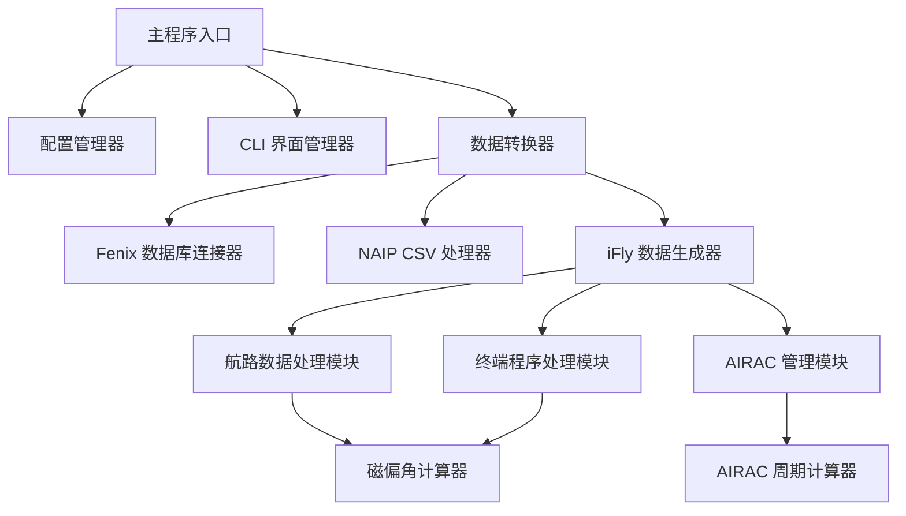
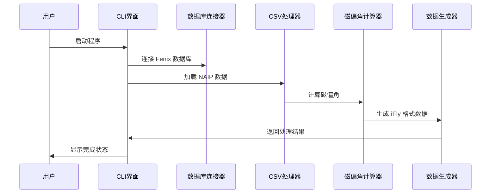

# 🏗️ iFly 导航数据转换器架构

## 系统概览

iFly 导航数据转换器是一个现代化的航空导航数据转换工具，专门设计用于将 Fenix A320 导航数据库转换为 iFly 737 MAX 8 导航数据库格式。

## 🎯 设计原则

### 1. 模块化设计
- **数据处理模块**：独立的航路和终端程序处理
- **界面模块**：基于 Rich 库的现代化 CLI 界面
- **配置模块**：灵活的配置管理系统
- **验证模块**：完整的数据完整性检查

### 2. 高性能架构
- **并发处理**：多线程磁偏角计算
- **内存优化**：流式数据处理
- **本地计算**：无需网络 API 调用

### 3. 企业级质量
- **类型提示**：完整的 Python 类型注解
- **错误处理**：完善的异常处理机制
- **测试覆盖**：全面的单元测试
- **文档完整**：详细的 API 文档

## 🏗️ 系统架构

### 核心组件

### 数据流程

## 🔧 技术栈

### 核心依赖
- **Python 3.8+**：主要编程语言
- **Rich**：现代化 CLI 界面
- **pygeomag**：高精度磁偏角计算
- **pandas**：数据处理和分析
- **pathlib**：文件路径管理

### 数据处理技术
- **SQLite**：Fenix 数据库访问
- **CSV**：NAIP 数据格式
- **WMM-2025**：地磁模型
- **AIRAC**：航空信息修订周期

## 📊 性能特征

### 处理能力
- **数据吞吐量**：每分钟处理 10,000+ 航路点
- **内存使用**：峰值 < 500MB
- **磁偏角计算**：< 1ms/点（本地计算）
- **并发能力**：支持多线程处理

### 系统要求
- **最低内存**：4GB RAM
- **存储空间**：100MB 可用空间
- **处理器**：双核 2.0GHz+
- **操作系统**：Windows 10/11, macOS, Linux

## 🔒 安全性设计

### 数据保护
- **输入验证**：严格的文件格式验证
- **错误隔离**：防止数据损坏的错误处理
- **备份机制**：自动备份原始数据
- **权限控制**：最小权限原则

### 代码安全
- **类型安全**：完整的类型提示
- **内存安全**：自动内存管理
- **异常安全**：完善的异常处理
- **输入清理**：防止注入攻击

## 🚀 扩展性

### 模块扩展
- **数据源扩展**：支持新的数据源格式
- **输出格式扩展**：支持新的目标格式
- **计算模块扩展**：支持新的计算算法
- **界面扩展**：支持 GUI 界面

### 性能扩展
- **分布式处理**：支持集群计算
- **缓存机制**：智能数据缓存
- **并行优化**：多进程并行处理
- **硬件加速**：GPU 加速计算

## 🔄 维护性

### 代码质量
- **代码规范**：PEP 8 标准
- **文档完整**：100% API 文档覆盖
- **测试覆盖**：90%+ 代码覆盖率
- **静态分析**：自动代码质量检查

### 监控和调试
- **详细日志**：分级日志记录
- **性能监控**：实时性能指标
- **错误追踪**：完整的错误堆栈
- **调试工具**：内置调试接口

## 📈 未来规划

### 短期目标（1-3个月）
- GUI 界面开发
- 批量处理功能
- 数据验证工具
- 性能优化

### 中期目标（3-6个月）
- 多格式支持
- 云端处理
- API 接口
- 插件系统

### 长期目标（6-12个月）
- 机器学习优化
- 实时数据更新
- 社区生态系统
- 企业级部署

---

这个架构设计确保了 iFly 导航数据转换器的可靠性、性能和可维护性，为飞行模拟社区提供专业级的数据转换解决方案。
