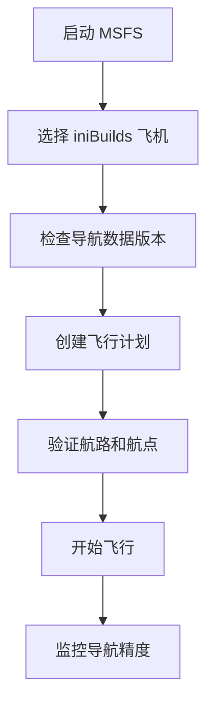

# iniBuilds 使用指南

本指南将帮助你充分利用 iniBuilds 导航数据，提供实用的使用技巧和最佳实践。

---

## 🎯 基础使用

### 首次使用

#### 1. 验证安装
在首次使用前，确认导航数据已正确安装：

1. **启动 MSFS** 并加载你的 iniBuilds 飞机
2. **检查 MCDU** 或导航系统是否显示正确的数据库版本
3. **验证机场信息** - 选择一个熟悉的机场，检查跑道和频率信息

#### 2. 基本操作流程



---

## 🗺️ 飞行计划创建

### 使用 MCDU 创建飞行计划

#### A300/A310 MCDU 操作

1. **初始化 MCDU**
   ```
   LSK1L: INIT
   LSK2L: ROUTE
   ```

2. **输入起降机场**
   ```
   FROM: ZBAA (北京首都)
   TO: ZSPD (上海浦东)
   ```

3. **选择 SID/STAR**
   ```
   DEP: TEDA1D (离场程序)
   ARR: DUMET1A (进场程序)
   APPR: ILS06L (进近程序)
   ```

4. **添加航路航点**
   ```
   VIA: P208-TAMOT-A470-DUMET
   ```

### 验证导航数据

#### 航点验证清单
- [ ] 航点坐标是否正确
- [ ] 航路高度限制是否合理
- [ ] SID/STAR 程序是否匹配
- [ ] 进近程序是否可用

#### 常用验证命令
```
MCDU: LSK6R (查看航点详情)
ND: ROSE NAV (导航玫瑰图模式)
PFD: 检查导航精度指示
```

---

## 🧭 导航功能详解

### VOR/DME 导航

#### VOR 电台使用
1. **选择 VOR 电台**
   ```
   NAV1: 频率设置
   CRS: 航向设置
   DME: 距离测量
   ```

2. **交叉定位**
   ```
   VOR1: 116.40 (BJC)
   VOR2: 117.90 (PKG)
   交叉点: 确定当前位置
   ```

### ILS 进近

#### 精密进近设置
1. **ILS 频率设置**
   ```
   NAV1: ILS 频率
   CRS: 跑道方向
   例如: 110.30 / CRS 060
   ```

2. **进近检查清单**
   - [ ] ILS 频率正确
   - [ ] 航向与跑道一致
   - [ ] 下滑道可用
   - [ ] 最低标准符合

### GPS/RNAV 导航

#### RNAV 程序
1. **RNAV SID 使用**
   ```
   选择: RNAV 离场程序
   检查: 所需导航性能 (RNP)
   确认: 航点序列正确
   ```

2. **RNAV STAR 使用**
   ```
   选择: RNAV 进场程序
   验证: 高度和速度限制
   准备: 进近程序衔接
   ```

---

## 📊 数据监控与验证

### 实时数据监控

#### 导航精度监控
```
PFD 显示:
├── ANP (实际导航性能)
├── RNP (所需导航性能)  
├── XTK (轨迹偏差)
└── GPS 状态指示
```

#### 数据完整性检查
- **RAIM 状态**: GPS 接收机自主完整性监测
- **EPU/EPV**: 估计位置误差 (水平/垂直)
- **卫星数量**: 可见卫星数量和信号强度

### 导航数据更新

#### 检查数据版本
```
MCDU: STATUS 页面
显示: AIRAC 2403 (示例)
有效期: MAR 02 - MAR 30
```

#### 过期数据处理
如果导航数据过期：
1. 下载最新数据包
2. 按照安装指南更新
3. 验证新数据正确性
4. 清除旧的缓存文件

---

## 🛠️ 高级功能

### 自定义航点

#### 创建用户航点
1. **在 MCDU 中创建**
   ```
   WPT: USER001
   LAT: N40°04.5'
   LON: E116°35.2'
   ```

2. **保存到数据库**
   ```
   STORE: 保存航点
   RECALL: 调用航点
   DELETE: 删除航点
   ```

### 多段飞行计划

#### 复杂航路规划
```
段落 1: ZBAA-VOR BJC-A593-TAMOT
段落 2: TAMOT-B208-DUMET  
段落 3: DUMET-STAR DUMET1A-ZSPD
```

#### 备选航路
```
主航路: A593-B208
备选 1: G204-H20
备选 2: 直飞 (DCT)
```

---

## 📱 外部工具集成

### Navigraph 集成

#### 数据同步
1. **账户链接**
   - 登录 Navigraph 账户
   - 下载最新 AIRAC 数据
   - 导入到 iniBuilds 系统

2. **图表查看**
   - 机场图
   - 进近图
   - 航路图

### SimBrief 飞行计划

#### 导入 SimBrief 计划
1. **生成飞行计划**
   ```
   SimBrief 网站:
   ├── 输入起降机场
   ├── 选择飞机类型
   ├── 生成航路
   └── 导出 MSFS 格式
   ```

2. **导入到 MCDU**
   ```
   MCDU: INIT 页面
   选择: IMPORT FPL
   来源: SimBrief
   ```

---

## 🔍 故障排除

### 常见问题解决

#### 导航偏差过大
**可能原因**:
- GPS 信号质量差
- 导航数据过期
- 系统校准问题

**解决方案**:
1. 检查 GPS 状态
2. 重新校准惯性导航系统
3. 验证导航数据版本

#### MCDU 显示异常
**症状**: 航点信息缺失或错误
**解决方案**:
1. 重启导航系统
2. 重新加载飞行计划
3. 检查数据文件完整性

#### 进近程序不可用
**可能原因**:
- 机场程序更新
- 数据包不完整
- 飞机配置问题

**解决方案**:
1. 检查机场 NOTAM
2. 使用备用进近程序
3. 手动设置进近参数

---

## 📊 性能优化技巧

### 提升加载速度

1. **预加载设置**
   ```ini
   PreloadRadius=100  # 预加载半径
   CacheSize=512MB    # 缓存大小
   ```

2. **定期清理缓存**
   ```
   位置: Navdata\cache\
   操作: 删除 *.tmp 文件
   频率: 每月一次
   ```

### 减少内存使用

1. **降低显示精度**
   ```ini
   CoordinatePrecision=2  # 降低坐标精度
   FontSize=10           # 减小字体大小
   ```

2. **限制数据范围**
   ```ini
   MaxNavaidRange=100    # 限制导航台范围
   AirportFilter=MEDIUM  # 过滤小机场
   ```

---

## 📚 学习资源

### 官方教程
- [iniBuilds A300 手册](https://inibuilds.com/manuals/a300)
- [导航系统操作指南](https://nav-data.org/guides/navigation)
- [MCDU 完全指南](https://nav-data.org/guides/mcdu)

### 社区资源
- [YouTube 视频教程](https://youtube.com/nav-data-tutorials)
- [Discord 社区](https://discord.gg/nav-data)
- [Reddit 讨论](https://reddit.com/r/nav-data)

### 实践建议
1. **从短途飞行开始**: 熟悉基本操作
2. **逐步增加复杂度**: 添加 SID/STAR 程序
3. **记录问题和解决方案**: 建立个人知识库
4. **参与社区讨论**: 分享经验和技巧

---

## 🎯 最佳实践

### 飞行前检查
- [ ] 验证导航数据版本
- [ ] 检查 NOTAM 和天气
- [ ] 确认备用程序
- [ ] 设置应急频率

### 飞行中监控
- [ ] 定期检查导航精度
- [ ] 验证航点通过
- [ ] 监控燃油和性能
- [ ] 准备备用计划

### 飞行后总结
- [ ] 记录任何异常
- [ ] 更新个人数据库
- [ ] 分享经验给社区
- [ ] 准备下次飞行

---

> 🚀 **专业提示**: 熟练使用 iniBuilds 导航数据需要时间和练习。建议从简单的点到点飞行开始，逐步掌握复杂的程序和功能。遇到问题时，不要忘记查看我们的 [故障排除指南](../contributing.md#故障排除) 或联系社区获取帮助！ 